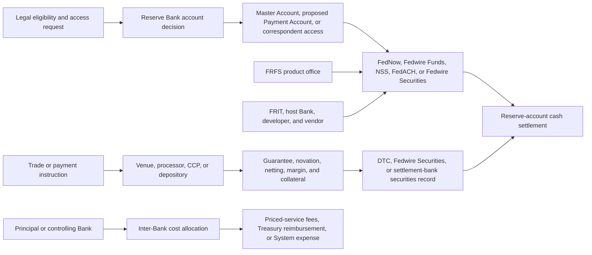

# Federal Reserve payment stack — control, finality and cost audit

**Cutoff:** 2026-07-25  
**Status:** pending workbench research; not promoted to the vault  
**Scope:** Federal Reserve account access, Federal Reserve payment rails, NSCC,
DTC, FICC, ICE Clear Credit, CME Securities Clearing, settlement banks,
Federal Reserve Financial Services, Federal Reserve Information Technology,
Treasury fiscal-agent technology and related software-cost allocation  
**Method:** review the existing Observatory payment corpus as one architecture,
then test its most important unanswered questions against current primary
sources  
**Dollar rule:** every monetary amount is written in full nominal dollars. When
the official source reports in rounded millions, the added zeros are
presentation rather than added precision.

---

## I. Bottom line

The existing research raised the right question, but the object needed to be
split more finely. There is no single “payments stack.” There are at least five
different control layers:

1. **access control** — who may hold a Reserve Bank account or use a service;
2. **operating control** — which Reserve Bank, product office, shared-service
   organization or vendor runs the application;
3. **credit and liquidity control** — who must prefund, who may borrow and who
   absorbs an intraday shortfall;
4. **record and finality control** — which ledger is authoritative and when a
   cash or securities transfer becomes final; and
5. **cost control** — which entity contracts, capitalizes, pays, reallocates and
   ultimately recovers the cost.

Those controls can belong to different institutions and operate on different
clocks.

The strongest new finding is the **clock gap**. Market infrastructure is
extending execution, clearing, guarantee and digital-ledger hours faster than
the underlying securities-transfer and central-bank cash-settlement hours.
During the gap, liquidity does not automatically come from the Federal Reserve.
It comes first from prefunded cash and collateral, member balance sheets,
sponsors, commercial banks, clearing banks and committed private facilities.

The second finding is the **access paradox**. The proposed Federal Reserve
Payment Account could reduce an eligible institution's dependence on a
correspondent bank, but it would itself be a strictly prefunded account: no
intraday credit, no discount window, no interest, no FedACH, no Fedwire
Securities delivery-versus-payment and a proposed closing-balance ceiling of
$1,000,000,000. It gives direct entry to selected rails without giving the
holder the full balance-sheet powers of a conventional master-account bank.

The third finding is the **accounting-control gap**. Public reports disclose
large software and payment-service amounts, but they do not provide a complete
application-level map linking the contracting Bank, controlling product office,
developer or cloud host, capitalized asset owner, cost-allocation recipients
and customer-recovery mechanism.

---

## II. The architecture the existing research implies

The diagram is deliberately not an ownership chart. The System is federated.
A Bank can host a national office, another Bank can control a product, another
Bank or vendor can develop or physically host the software, and all 12 Banks or
an outside principal can bear the final cost.

---

## III. Questions raised by the existing payment corpus

### Priority 1 — questions that determine who actually controls settlement

| Question | Why it matters | Current answer |
|---|---|---|
| Where does finality occur when a trade is guaranteed, a token moves and the cash rail is closed? | “Cleared,” “recorded,” “delivered” and “paid” are not synonyms. | Finality remains layer-specific. A CCP guarantee does not itself create securities delivery or reserve-account cash finality. |
| Who supplies liquidity during the evening, Sunday and holiday gaps? | Longer clearing hours can create obligations before the normal settlement assets can move. | First-line bridges are private and prefunded. Federal Reserve credit reaches eligible account holders, not every market participant or wallet. |
| Who receives direct Reserve Bank access, and what powers come with each account? | Account form determines credit, services, correspondent dependence and competitive position. | Existing-access data combine own-account and correspondent access. The proposed Payment Account is a narrower, no-credit account. |
| Which record wins if a blockchain record, a depository's digital record and its legacy books diverge? | Legal ownership and operational state can separate. | DTC remains the controller and retains correction powers. The precise conflict-of-record procedure still needs a public operating-rule test. |
| Which institution is the indispensable settlement bank for each CCP? | “Central clearing” can still depend on a small private-bank layer. | BNY Mellon is publicly identified in important FICC and ICE Treasury-settlement roles. Backup, portability and outage routes remain incomplete. |

### Priority 2 — questions that determine the economic subsidy and concentration

| Question | Why it matters | Current answer |
|---|---|---|
| When and how is FedNow expected to recover its cost? | Mature priced services are measured against cost-recovery requirements; FedNow was excluded while costs and volumes stabilized. | Public sources show the exclusion and costs, but not a complete service-specific recovery horizon. |
| Does a payment-service price recover only current operating expense, or also prior development, capital and imputed private-sector costs? | A service can appear inexpensive if development and shared infrastructure sit elsewhere. | Mature-service reporting includes operating and imputed costs. The application-level allocation and FedNow development-recovery bridge remain incomplete. |
| Which applications depend on the same cloud provider, region, network vendor or host Bank? | Different rails can share one operational failure point. | The corpus names several provider/platform relationships, but not a complete provider-application-region-contract register. |
| What collateral value will tokenized DTC assets receive? | A transferable entitlement is not automatically usable funding collateral. | Initial value is zero in DTC's Collateral Monitor and Net Debit Cap calculations. Future eligibility and haircuts are open. |
| What happens when several CCPs demand cash from the same firm at the same time? | Cross-margining can reduce normal-period collateral while increasing dependency among default-management systems. | Each CCP has its own waterfall and calls. The combined participant-level liquidity demand is not publicly mapped. |

### Priority 3 — questions that determine auditability

| Question | Why it matters | Current answer |
|---|---|---|
| What common identifier follows an obligation through clearing, payment, correction and recovery? | A payment message is not the same object as the government's authoritative accounting record. | The existing federal-transaction-record research shows no publicly established universal key across the full chain. |
| Which Bank contracted, which Bank controls, which entity hosts and who ultimately paid for each material application? | A Bank-level software balance can reflect national accounting ownership rather than local use. | The Financial Accounting Manual supplies the rule; public statements do not supply the full application ledger. |
| Which Treasury fiscal-agent applications account for the published payment, debt, accounting and technology costs? | Treasury reimbursement can hide the operational scale if it is viewed only as net Fed expense. | Functional totals are public; named application, vendor, host and invoice detail are incomplete. |
| Which clearing and tokenization incidents are disclosed publicly, and on what clock? | Continuous operation makes outage, reversal and reconciliation evidence central. | Public release and rule records exist, but no unified incident, correction and finality register was found. |

---

## IV. Settlement clocks and points of finality

### A. One transaction can have five different “final” moments

| Layer | Binding event | Controller |
|---|---|---|
| execution | buyer and seller enter a trade or payment instruction | venue or bilateral contract |
| guarantee or novation | clearinghouse becomes responsible under its rules | NSCC, FICC, ICE Clear Credit or another CCP |
| securities record | ownership or entitlement changes on the authoritative ledger | DTC, Fedwire Securities or a settlement bank |
| cash settlement | the cash obligation is discharged | Fedwire Funds, NSS or an authorized private settlement bank |
| customer entitlement | broker or custodian records the customer's claim | broker or custodian |

A guarantee can become binding before margin is collected. A securities token
can move while central-bank cash is unavailable. A customer can see a position
before the market utility's end-of-day net cash settlement is complete.

### B. NSCC now clears beyond the Fedwire settlement window

NSCC's extended service became live on 2026-06-28/29 and processes continuously
from Sunday at 8:00 p.m. through Friday at 8:00 p.m. Eastern Time. Its guarantee
generally attaches when the trade is validated.

The exact current seams are:

- Sunday: NSCC opens at 8:00 p.m.; Fedwire Funds opens at 9:00 p.m. — a
  one-hour gap.
- Monday through Thursday: Fedwire Funds closes at 7:00 p.m. and reopens at
  9:00 p.m. while NSCC remains open — a two-hour daily gap.
- Fedwire Securities begins transfer processing at 8:30 a.m.; important
  securities and repositioning cutoffs occur from 3:15 p.m. through 4:30 p.m.
- Federal Reserve holidays create larger mismatches.
- NSCC's added 3:00–5:45 a.m. risk calculations monitor positions; they do not
  prove that cash can be collected over a 24-hour rail every fifteen minutes.
- DTC did not extend its ordinary deposit deadlines merely because NSCC
  extended clearing.

The announced future Fedwire Funds/NSS extension is no earlier than 2028 and
could be 2029. It would still retain approximately 26 hours of weekend
downtime, and the announcement does not extend Fedwire Securities.

Primary sources:

- [SEC NSCC extended-hours approval order](https://www.sec.gov/files/rules/sro/nscc/2026/34-105565.pdf)
- [DTCC live announcement](https://www.dtcc.com/news/2026/june/29/nscc-now-live-with-clearing-hours-extended)
- [Fedwire Funds operating hours](https://www.frbservices.org/resources/financial-services/wires/operating-hours.html)
- [Fedwire Securities operating hours](https://www.frbservices.org/resources/financial-services/securities/operating-hours)
- [Federal Reserve future Fedwire expansion announcement](https://www.federalreserve.gov/newsevents/pressreleases/other20251009a.htm)

### C. The liquidity ladder

When clearing or margin obligations arise outside the relevant settlement
window, the public rule structure points to this ladder:

1. prepositioned member cash and eligible collateral;
2. the member's own treasury balance sheet;
3. commercial-bank credit, repo funding and custody-bank arrangements;
4. sponsor or agent-clearer funding, but only where the contract provides it;
5. CCP prefunded resources and committed bank facilities after a failure;
6. Federal Reserve intraday credit to an eligible institution with the
   necessary Reserve Bank account;
7. final settlement when Fedwire Funds, NSS, Fedwire Securities or the
   designated private-bank books are available; or
8. a pending, rejected or failed transaction.

An NSCC settling bank is not required merely by acting as settlement agent to
guarantee or advance the customer's money. If it refuses a debit, the member
remains liable and must fund through the permitted route.

No authoritative evidence reviewed here shows NSCC, FICC or DTC accepting
FedNow as an alternative rail for ordinary margin or end-of-day settlement.

### D. FedNow proves 24/7 central-bank settlement, but not securities DVP

FedNow operates continuously and provides final central-bank-money settlement
for payments processed under its own rules. Since 2025-11-12, the maximum
customer credit transfer, return and liquidity-management transfer is
$10,000,000.

That does not make FedNow a general-purpose NSCC, FICC, DTC or CCP-margin rail.
Its liquidity-management transfer supports instant-payment liquidity among
qualifying accounts. The clearinghouse use case would require separate rules,
messages, participant eligibility, risk controls and integration.

Primary sources:

- [FedNow operating hours](https://www.frbservices.org/resources/financial-services/fednow/operating-hours)
- [FedNow transfer-limit change](https://www.frbservices.org/news/communications/111225-fednow-transaction-limit-increase)
- [FedNow operating procedures](https://www.frbservices.org/binaries/content/assets/crsocms/resources/rules-regulations/062425-fednow-service-operating-procedures.pdf)

### E. DTC tokenization currently moves an entitlement, not settlement money

The status clocks must remain separate:

- 2025-12-11: SEC staff conditional no-action position;
- 2026-07-15: limited activity in DTC's production environment involving more
  than 30 firms;
- October 2026: participant-facing preliminary base-version launch remains a
  future target.

In the base design, DTC-custodied assets can receive a tokenized entitlement,
while DTC remains the central controller. DTC retains freeze, reversal,
force-transfer, clawback, pause and reconciliation powers. The tokenized asset
initially receives **zero value** for DTC Collateral Monitor and Net Debit Cap
purposes.

DTCC described July 15 workflows including delivery-versus-payment, repo,
securities lending, collateral pledge and CCP margin. The public release did
not identify:

- the cash settlement asset or rail;
- the cash-finality rule;
- transaction CUSIPs and full-dollar values;
- matched counterparties;
- chain transaction identifiers;
- execution, ledger and cash-finality timestamps; or
- whether transactions remained live or were reversed after the event.

“Delivery-versus-payment” in the release therefore does not prove
central-bank-cash delivery-versus-payment.

Primary sources:

- [SEC staff no-action letter](https://www.sec.gov/files/tm/no-action/dtc-nal-121125.pdf)
- [DTCC July 15 limited-production announcement](https://www.dtcc.com/news/2026/july/15/dtcc-turns-tokenization-into-reality)
- [DTCC production-event page](https://www.dtcc.com/digital-assets/tokenization/live-production-trades)

### F. Treasury CCPs still depend on bank and securities-settlement layers

| Utility | Current state | Settlement/control seam |
|---|---|---|
| FICC Government Securities Division | current and expanding; mandatory cash-Treasury compliance remains 2026-12-31 and repo compliance remains 2027-06-30 | novation at comparison; securities through Fedwire Securities or designated clearing-bank books; funds-only settlement through NSS; disclosed clearing-bank infrastructure is concentrated at BNY Mellon |
| ICE Clear Credit Treasury | cash-Treasury service described as launched; repo service not established here as live | BNY Mellon identified as initial settlement bank; published minimum participant guaranty-fund contribution is $20,000,000; ICE initial contribution is $100,000,000 |
| CME Securities Clearing | SEC-registered/design published; current CME page still says the service “will launch” | designed Sunday 5:00 p.m. through Friday 8:00 p.m.; finality occurs when designated bank accounts are actually debited and credited |

FICC's scheduled Government Securities Division calls at 9:30 a.m. and
2:45 p.m., plus possible one-hour ad hoc calls, expose the securities-hours
problem directly: a participant can owe cash while its preferred Treasury
collateral cannot move through Fedwire Securities.

---

## V. The access gate

### A. The public database does not identify every master-account holder

The Board's Existing Access database includes both:

- institutions with their own Reserve Bank master account; and
- institutions accessing services by settling through another depository
  institution's master account.

The presence of an institution in that database therefore does not prove it
has its own account. The Access Requests database uses the same own-account or
correspondent-access boundary. It covers requests submitted after 2022-12-23
and requests still pending on that date. The Board says it updates the database
quarterly; the current records are through 2026-05-31.

Primary source:
[Federal Reserve Master Account and Services Database — About](https://www.federalreserve.gov/paymentsystems/master-account-and-services-database-about.htm).

### B. Kraken is the concrete Tier 3 test case

The live Federal Reserve CSV records show:

| Field | Record |
|---|---|
| institution | Kraken Financial |
| request submitted | 2020-10-06 |
| federal deposit insurance | not federally insured |
| initial tier | Tier 3 |
| action | approved |
| action date | 2026-01-28 |
| access-effective date | 2026-01-28 |
| Reserve Bank | Federal Reserve Bank of Kansas City |

Kansas City publicly described the institution as Payward Financial, doing
business as Kraken Financial, a Wyoming Special Purpose Depository Institution.
It approved a limited-purpose account for an initial one-year term with
undisclosed restrictions tailored to Kraken's business model and risk profile.

That example proves that “approved” does not mean “unrestricted,” and that the
public database does not reveal the exact service set or tailored controls.

Primary sources:

- [Kansas City Fed limited-account announcement](https://www.kansascityfed.org/newsroom/2026-news-releases/federal-reserve-bank-of-kansas-city-approves-limited-account/)
- [Existing Access CSV](https://www.federalreserve.gov/paymentsystems/account-and-access-disclosure/holder-data.csv)
- [Access Requests CSV](https://www.federalreserve.gov/paymentsystems/account-and-access-disclosure/requestor-data.csv)

### C. The proposed Payment Account

The Board's proposal is not final. Comments close 2026-07-27. It would not
change statutory eligibility, and the individual Reserve Bank would continue
to decide access under Board guidelines.

| Proposed term | Effect |
|---|---|
| intraday credit | none |
| discount-window access | none |
| interest on balances | none |
| overdrafts | automated rejection |
| permitted services | Fedwire Funds, FedNow, NSS and Fedwire Securities free transfers |
| unavailable services | FedACH, Check, Currency and Fedwire Securities delivery-versus-payment |
| correspondent activity | holder may not act as correspondent and may not use the account to settle a respondent's activity |
| closing balance | based on expected payment activity, capped at $1,000,000,000, subject to narrow temporary-exceedance provisions |
| review expectation | generally 90 calendar days after all requested documentation for a Tier 2 or Tier 3 Payment Account request |

The Board also encouraged Reserve Banks to pause decisions on Tier 3 account
requests while the policy process remains open.

This design moves the access frontier without moving the credit frontier. A
holder can reach real-time rails directly but must maintain enough cash to
avoid rejection, especially across weekends and holidays. The result may
reduce ordinary correspondent dependence while increasing the importance of
private liquidity providers.

Primary sources:

- [Board May 20 proposal release](https://www.federalreserve.gov/newsevents/pressreleases/other20260520a.htm)
- [Federal Register notice, Docket OP-1878](https://www.federalregister.gov/documents/2026/05/26/2026-10375/proposed-revisions-to-the-federal-reserve-policy-on-payment-system-risk-and-the-guidelines-for)

---

## VI. Operating control and cost

### A. Current payment-service control stack

| Layer | Current public answer | Boundary |
|---|---|---|
| legal owner/operator | the 12 Federal Reserve Banks collectively | FRFS is a national business line, not a separately identified thirteenth Bank or subsidiary |
| day-to-day business manager | Federal Reserve Financial Services, led by the chief payments executive | management is performed on behalf of all 12 Banks |
| strategic oversight | Conference of Presidents through its Payments Committee | Reserve Bank boards and presidents retain legal responsibility for activities performed by their Banks |
| national IT policy | Conference of Presidents' Information Technology and Operations Committee | the complete approval matrix between business and technology control is not public |
| infrastructure | Federal Reserve Bank of Richmond / National IT supplies national hosting and the infrastructure used by Fedwire Securities | infrastructure responsibility does not identify every contracting or asset-owning Bank |
| business requirements and customer access | FRFS defines business requirements and specifications and supplies customer-access solutions | application-level owner, developer and invoice payer remain undisclosed |
| federal supervision | Board Division of Reserve Bank Operations and Payment Systems | Board supervision and price approval are not Board ownership of the service assets |

The former Wholesale Product Office at the New York Fed is not the current
enterprise manager. It was dissolved when the new FRFS structure took effect
on 2022-07-01. New York still performs specific operational and
securities-account functions, but that is different from owning or managing
Fedwire Funds, Fedwire Securities or NSS for the enterprise.

The legal layer is being consolidated too. Effective 2026-01-05, FRFS began
moving common contractual terms into Operating Circular 5, renamed *General
Financial Service Provisions*.

Current product attribution:

| Product | Legal operator | Business controller | Remaining seam |
|---|---|---|---|
| Fedwire Funds | 12 Reserve Banks | FRFS | National IT supplies infrastructure; application owner and invoice-paying Bank are not public |
| Fedwire Securities | 12 Reserve Banks | FRFS | Richmond/National IT runs infrastructure; New York and Chicago keep specified securities accounts but are not thereby enterprise product owners |
| NSS | 12 Reserve Banks | FRFS | application owner and contracting Bank are not public |
| FedACH | 12 Reserve Banks | FRFS | historical product-office hosts should not be treated as current without a post-2022 source |
| Check | 12 Reserve Banks | FRFS | Atlanta processing instructions do not prove Atlanta records every service asset or vendor invoice |
| FedNow | 12 Reserve Banks | FRFS through its chief FedNow executive | Boston's development role is historical evidence; current asset owner, cloud contractor and payable holder are not public |
| FedLine | 12 Reserve Banks; access principally through Operating Circular 5 | FRFS | Chicago administers FRBservices.org, but that does not prove Chicago owns the FedLine asset or pays its network vendors |

Primary sources:

- [2025 Fedwire Securities PFMI disclosure](https://www.frbservices.org/binaries/content/assets/crsocms/financial-services/securities/securities-service-disclosure.pdf)
- [FRFS leadership](https://www.frbservices.org/about/leadership)
- [2026 Operating Circular changes](https://www.frbservices.org/binaries/content/assets/crsocms/resources/rules-regulations/010526-summary-of-changes.pdf)

### B. Public cost surface

| Object | Public amount | Accounting state |
|---|---:|---|
| 2024 Reserve Bank operating software cost | $548,800,000 | actual |
| 2025 Reserve Bank operating software | $662,200,000 | budget; not actual |
| Reserve Bank capitalized software, net, 2024 year-end | $597,000,000 | actual balance |
| Reserve Bank capitalized software, net, 2025 year-end | $646,000,000 | actual balance |
| change in net capitalized software | $49,000,000 | balance-sheet change; not cash additions |
| 2025 Reserve Bank software amortization | $193,000,000 | actual expense |
| 2025 Board Information Technology operating expense | $209,900,000 | budget |
| 2025 Board operating software expense | $47,177,950 | actual |
| 2025 Board software in use and in process, gross | $90,483,117 | actual balance |
| 2025 Board hosting-arrangement implementation cost, gross | $28,008,654 | actual balance |
| 2025 FRIT positions | 1,789 | budgeted positions, not dollars |
| 2025 Board Information Technology positions | 438 | budgeted positions, not dollars |

The $49,000,000 increase in net Reserve Bank capitalized software cannot be
called “cash spent.” Additions, transfers among Banks, amortization, impairment
and disposals are not separately rolled forward in the combined note.

### C. Public payment-service economics

| Service | 2024 operating and imputed cost |
|---|---:|
| FedNow | $231,100,000 |
| FedACH | $166,500,000 |
| Fedwire Funds and National Settlement | $151,700,000 |
| Check | $104,500,000 |
| Fedwire Securities | $41,600,000 |

FedNow's reported implementation spending through launch was $545,000,000.

For mature priced services in 2024:

| Measure | Amount |
|---|---:|
| revenue from operations | $524,300,000 |
| operating and imputed costs | $464,200,000 |
| net income | $60,100,000 |
| reported cost recovery | 110.6% |

FedNow was excluded from the mature-service projection because its volume,
cost and revenue were not considered stable. The exact unanswered accounting
question is how its past development cost, current operating cost, shared
infrastructure and imputed private-sector adjustments will enter its eventual
recovery requirement and price schedule.

The current pricing record adds two future objects that must not be mistaken
for audited actuals:

| Mature priced-service object | 2025 forecast | 2026 budget |
|---|---:|---:|
| revenue | $543,800,000 | $556,000,000 |
| operating/imputed or total expense | $493,700,000 | $502,100,000 |
| net income | $50,400,000 | $53,900,000 |
| targeted return on equity | $10,800,000 | $12,600,000 |
| recovery after targeted return | 107.8% | 108.0% |

The four mature-service rail rows sum to $464,300,000 while the published
aggregate is $464,200,000. The $100,000 difference is source rounding rather
than evidence of a missing program.

The Board expects FedNow's first long-run recovery to fall outside the ordinary
ten-year window. The public record does not show which mature-service surplus,
Reserve Bank earnings or internal allocation funded each annual FedNow
shortfall or its present cumulative recovery balance.

Primary sources:

- [2024 Payment System and Reserve Bank Oversight](https://www.federalreserve.gov/publications/2024-ar-payment-system-and-reserve-bank-oversight.htm)
- [2026 Federal Reserve service-pricing notice](https://www.federalreserve.gov/newsevents/pressreleases/files/other20251204a1.pdf)

### D. Host-Bank accounting can conceal the real control chain

Federal Reserve Financial Services manages Check, FedACH, Fedwire Funds,
Fedwire Securities, NSS, FedNow and electronic access across the Banks.
Federal Reserve Information Technology supplies national infrastructure.

The Financial Accounting Manual allows this arrangement:

- one Bank can pay or contract for development;
- another Bank or outside vendor can develop or physically host the system;
- a product office hosted by a third Bank can control requirements, operation
  and retirement;
- the controlling Bank can record the whole software asset; and
- the costs can be allocated to all benefiting Banks or to an outside
  principal.

Richmond's 2025 statements illustrate the scale. Richmond received
$1,135,000,000 from the other Reserve Banks for computing and System-support
costs. That is an internal redistribution, not a loan, donation or additional
external System expense. It also is not, by itself, the external vendor total.

The minimum application ledger therefore needs these fields:

| Required field | Question |
|---|---|
| contracting entity | Which Bank or Board office signed the agreement and paid the invoice? |
| controlling entity | Which product or function office sets requirements, operation and retirement? |
| development and physical host | Which Bank, FRIT facility, cloud provider or other vendor builds and runs it? |
| accounting owner | Which Bank capitalizes and amortizes the asset? |
| benefiting recipients | Which Banks, Treasury functions or business lines receive the cost allocation? |
| revenue or reimbursement | Is the cost recovered through priced-service fees, Treasury reimbursement, Board assessment or System expense? |

The individual-Bank service entries are estimated monthly through the
Interdistrict Settlement Account and trued to actual cost in the next month.
Customer revenue is recorded gross. In the 12-Bank combined statements, the
reciprocal receivables, payables and allocations disappear or net, while
external payroll and vendor expense remain.

### E. Treasury is a major payment-technology principal

The latest public functional detail is 2024:

| Treasury fiscal-agent function | Expense |
|---|---:|
| payment services | $339,597,000 |
| debt financing and securities services | $244,194,000 |
| financial accounting and reporting | $86,550,000 |
| technology infrastructure | $177,052,000 |
| **Treasury subtotal** | **$847,392,000** |
| other reimbursable entities | $11,930,000 |
| **total reimbursable expense** | **$859,322,000** |

The Reserve Banks recognized $934,000,000 of reimbursable government-agency
service income in 2025, but the audited statement does not publish the same
functional breakout.

This lane should not be described as the Fed “funding research for Treasury.”
It is statutory fiscal-agent operating work: government payments, public-debt
issuance and servicing, accounting/reporting and technology infrastructure.
Treasury is the principal and reimburses the Reserve Banks. The remaining
question is which named applications, Banks and vendors sit inside each
function.

### F. Vendor boundary

No official Federal Reserve source located in this pass assigns a
payment-system dollar payment to Amazon Web Services or another cloud vendor.

- A vendor's statement that its cloud is important to FedNow does not turn
  FedNow's $545,000,000 implementation total into that vendor's award.
- A FedLine pricing notice identifies a new network vendor without naming it.
- Reserve Bank public statements do not disclose FRFS or National IT accounts
  payable by vendor.
- Named Board enterprise platforms do not establish a FedNow, Fedwire, FedACH
  or FedLine vendor-payment ledger.

The correct state is therefore `named technology relationship in some cases /
payment and contract value not publicly established`, not `vendor received the
service or project total`.

---

## VII. What is answered, partly answered and still open

### Answered strongly enough for the factual spine

- The payment stack has several legal and operating points of finality.
- Longer clearing and token-transfer hours do not themselves extend Fedwire
  Securities or prove continuous central-bank-cash delivery-versus-payment.
- Private and prefunded liquidity bridges the first gap.
- FedNow is a continuous central-bank payment rail, but it is not currently
  established as a general CCP margin or securities-settlement rail.
- DTC remains the authority over its tokenized entitlement system and initially
  gives tokenized assets zero DTC collateral/risk-control value.
- The Existing Access database cannot distinguish every own master account
  from correspondent access.
- The proposed Payment Account would separate direct rail access from Federal
  Reserve credit.
- Bank-level software balances do not identify local use or cash spending.
- Richmond's $1,135,000,000 is inter-Bank cost redistribution.
- Treasury reimbursement is an external-principal relationship, not an
  eliminated Reserve Bank intercompany flow.

### Partly answered

- The finality and cash-leg design of DTC's July 15 tokenized transactions.
- BNY Mellon's concentration across FICC and ICE Treasury settlement.
- FICC's collateral and cash response when Fedwire Securities is closed.
- FedNow's eventual full-cost recovery and pricing path.
- The service and restriction set attached to Kraken's one-year account.
- Cloud and network concentration across national Federal Reserve services.

### Still open

1. Exact cash asset, rail, full-dollar value and timestamps for each DTC July 15
   delivery-versus-payment transaction.
2. NSCC treatment of a one-hour margin deadline that falls inside a Fedwire
   closure or holiday.
3. Actual lending commitments, not merely settlement-agent status, for NSCC
   settling banks and FICC sponsor/agent relationships.
4. FICC backup if BNY Mellon is unavailable.
5. ICE Treasury participant roster, daily volume and direct-versus-settlement-
   bank Federal Reserve account structure.
6. Evidence that CME Securities Clearing has cleared and settled its first live
   trade.
7. Rule and haircut that would give tokenized DTC assets positive collateral or
   settlement value.
8. Conflict-of-record procedure across blockchain, LedgerScan and legacy DTC
   systems.
9. Whether and when Fedwire Securities hours will expand.
10. Discount-window operating arrangements for future Sunday or holiday
    Fedwire days.
11. Application-level FRFS/FRIT/Treasury contract, controller, host, vendor,
    capitalized-asset and allocation ledger.
12. FedNow development-to-recovery bridge and the date it enters the mature
    priced-service aggregate.
13. Common transaction/supersession key across obligation, payment, reversal,
    correction and recovery.
14. Unified public incident and correction register across the linked rails.
15. Nonpublic FRFS Enterprise Principles and the exact delegation among the
    chief payments executive, Payments Committee and individual Bank boards.
16. Richmond's $1,135,000,000 allocation by Bank, service, payroll, vendor and
    capital project.
17. Whether benefits, Board assessments and nationally provided support are
    allocated to each priced service before statutory recovery is measured.
18. Which pre-2022 product-office host relationships survived only as
    operational nodes and which authority assignments ended with the FRFS
    reorganization.
19. Bank-to-Bank elimination entries that reconcile each individual Bank's
    service revenue and expense to the combined statements.

---

## VIII. Research triggers and falsifiers

| Trigger | What it would change |
|---|---|
| Board adopts, revises or withdraws the Payment Account proposal | changes the access and prefunding lane |
| Tier 3 decision pause ends | reopens the high-scrutiny account clock |
| Kraken account renewal, expiry or revised access announcement around 2027-03 | tests whether limited direct access persists |
| DTC publishes the preliminary base-version launch notice | moves tokenization from limited production to participant service |
| DTC assigns positive Collateral Monitor or Net Debit Cap value | changes tokenized assets from transferable entitlements toward funding collateral |
| DTCC discloses July 15 cash-leg and transaction evidence | can prove or falsify central-bank-cash delivery-versus-payment |
| CMESC publishes first live clearing and settlement volume | moves the service from designed/registered to operational |
| Fedwire Securities extension proposal | narrows the security-delivery clock gap |
| Federal Reserve publishes 2025 actual operating software by comparable line | replaces the $662,200,000 budget proxy |
| FRFS publishes a FedNow recovery horizon or service-specific pro forma | clarifies subsidy and price formation |
| named application/vendor/host schedules appear | converts the software-control model into a counterparty ledger |

The central falsifier for the current storyline would be authoritative evidence
that a linked clearing utility can collect every required cash or collateral
obligation continuously in final central-bank money or final securities
delivery whenever its clearing or digital ledger is open. The reviewed record
does not establish that.

---

## IX. Source and corpus spine

### Existing Observatory corpus reviewed

- `CLEARING_HOUSE_TRANSITION_DEEP_DIVE.md`
- `CLEARING_HOUSE_TRANSITION_TIMELINE.md`
- `TREASURY_FED_MONEY_STATE_TIMELINE.md`
- `FEDERAL_RESERVE_SYSTEM_ENTITY_TRANSACTION_AND_SOFTWARE_MAP.md`
- `FEDERAL_RESERVE_USES_OF_MONEY_LEDGER_2025.md`
- `FEDERAL_RESERVE_ACTUAL_JOB_AND_OPERATING_STORY.md`
- `DTC_TOKENIZATION_SOFT_LAUNCH_STATUS_2026-07-15.md`
- `FEDERAL_TRANSACTION_RECORD_DEEP_DIVE_2026-07-23.md`
- `FINTECH_SWEEP_PAYMENT_ORCHESTRATORS.md`
- the 2026-07-21 SWIFT source and execution-wave files

### Additional primary-source spine

- Federal Reserve Board Payment Account release and Federal Register notice
- Federal Reserve Master Account and Services databases and CSVs
- Kansas City Fed Kraken limited-account announcement
- FRBservices operating-hour and operating-procedure pages
- SEC NSCC extended-hours order
- NSCC, DTC and FICC rules, disclosures and service guides
- DTC no-action letter and July 15 production-event records
- ICE Clear Credit Treasury rules
- CME Securities Clearing rulebook and service page
- Federal Reserve budget, audited financial statements and Financial
  Accounting Manual already captured in the System transaction/software map
