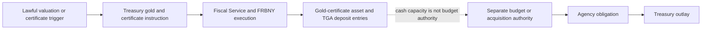
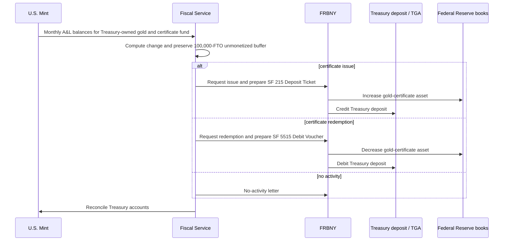

# Gold Certificate–TGA Authority Dossier

## Who can authorize, execute, record and spend

Updated: 2026-08-16 ET  
Status: pending workbench research; not reviewed or landed in the vault  
Evidence cutoff: 2026-08-16 ET  
Scope: the current U.S. statutory, operational, accounting and budgetary chain for Treasury gold certificates and the Treasury General Account  
Boundary: this dossier establishes decision rights and ledger effects. It is not a gold-price thesis, a forecast, or a claim that any proposal has become law.

Companion documents:

- [GOLD_USE_HOLDINGS_AND_CUSTODY_MAP_2026-08-16.md](../sources/gold-use-holdings-and-custody-map-2026-08-16-c6534962dbcf.html) — physical stock, title, custody and record topology
- [GOLD_MONETARY_USE_MECHANISM_MAP_2026-08-16.md](../sources/gold-monetary-use-mechanism-map-2026-08-16-740aee22a4fc.html) — the broader monetary, monetized and mobilized mechanism map
- GOLD_FIRST_USE_WATCHBOARD_2026-08-16.md — the receipts that would promote any dormant or proposed branch
- WHOLESALE_METALS_DATA_SPINE_SPEC.md — the rule that PRICE, TITLE, FLOW and RULE must remain separate

---

## Finding

The United States already operates a gold-certificate monetization mechanism. Treasury gold is valued for this purpose at the statutory price of **$42 2/9 per fine troy ounce**; nearly all of it is represented by nonredeemable gold certificates held by the Federal Reserve; and certificate issuance produces a matching credit to Treasury's deposit balance at the Federal Reserve Bank of New York.

That mechanism answers a **cash-financing** question. It does not answer the separate **budget-authority** question.

Treasury's own operating guidance says certificate proceeds enter the Treasury General Account and are available for general federal operating expenses. Federal budget law simultaneously requires an appropriation or other lawful budget authority before an agency may incur an obligation or make an expenditure. The two statements are compatible:

> a certificate can add cash to the government's payment account without creating a new legal purpose, obligation limit or acquisition mandate.

The shortest accurate chain is therefore:

No primary source reviewed through the cutoff establishes a current lawful official-price change, new certificate revaluation transaction, Bitcoin acquisition authority funded from certificates, or expenditure attributable to such a change.

---

## 1. Seven evidence gates

Every claim in this lane must be assigned to the highest gate actually proved.

| Gate | Question | Receipt that proves it | What does not prove it |
|---|---|---|---|
| **1 — valuation law** | What value may Treasury use for certificate purposes? | Current U.S. Code or later enacted law | A market quote, bill, hearing, executive analogy or accounting manual |
| **2 — certificate authority** | May certificates be issued, redeemed or adjusted against qualifying government gold? | 31 USC 5117 plus a valid implementing instruction | Mere ownership or custody of gold |
| **3 — operational execution** | Did Treasury and FRBNY execute an issue, redemption or adjustment? | Dated instruction plus SF 215, SF 5515 or equivalent FRBNY/Treasury transaction record | The standing monthly procedure or account eligibility |
| **4 — accounting effect** | Did the certificate asset, Treasury deposit liability and Treasury books reconcile? | Matching dated entries and account reconciliation | A change on only one report or an unexplained TGA move |
| **5 — budget authority** | May an agency incur obligations for a stated purpose and amount? | Appropriation or other authority legally available for that purpose | Cash in the TGA, a score, a policy announcement or a financing source |
| **6 — obligation and outlay** | Was the authority actually used? | Contract/order/transfer plus obligation and disbursement records | Enactment, allocation, apportionment or account availability alone |
| **7 — demonstrated effect** | Did the transaction acquire the intended asset or change the intended balance sheet? | Receiving, custody, audit and financial-statement records | A payment without proof of the acquired object or its final owner/custodian |

This is also the claim-audit rule: a later gate may depend on an earlier one, but it cannot be inferred from it.

---

## 2. Current legal hierarchy

### 2.1 Government title and certificate price

[31 USC 5117](https://uscode.house.gov/view.xhtml?req=%28title%3A31+section%3A5117+edition%3Aprelim%29) provides that title to covered gold is vested in the United States and that the Secretary of the Treasury holds it. It directs the Secretary to issue gold certificates for transferred gold and permits issuance for other gold held in Treasury. Outstanding certificates cannot exceed the value of the gold held against them at **$42 2/9 per fine troy ounce**, and Treasury must retain matching gold as security.

The price is in statute. The Federal Reserve's accounting manual explains the entries that follow **if** the official price changes; it does not itself change that price. No reviewed current authority establishes that the President, Treasury Secretary or Federal Reserve can replace the statutory price by instruction alone.

### 2.2 Purchases and sales are a different branch

[31 USC 5116](https://uscode.house.gov/view.xhtml?edition=prelim&num=0&req=granuleid%3AUSC-prelim-title31-section5116) authorizes the Secretary, with the President's approval, to buy or sell gold in the public interest. Purchased gold becomes a general-fund asset. Sale proceeds must be deposited in the general fund and used **solely to reduce the national debt**.

That power is not the same as certificate issuance or an official-price change. A presidential approval and Secretary sale order would prove a transaction branch; neither would convert the sale proceeds into a general-purpose acquisition fund.

### 2.3 Federal Reserve roles are fiscal-agent and accounting roles

[12 USC 391](https://uscode.house.gov/view.xhtml?req=%28title%3A12+section%3A391+edition%3Aprelim%29) authorizes Federal Reserve Banks to act as government depositaries and fiscal agents. Treasury's [TFM Volume II, Part 6, Chapter 2000](https://tfx.treasury.gov/tfm/volume2/part6/chapter-2000-issuance-and-redemption-gold-certificates) assigns FRBNY the certificate issue/redemption execution on Treasury's behalf.

[12 USC 412](https://uscode.house.gov/view.xhtml?edition=prelim&num=0&req=granuleid%3AUSC-prelim-title12-section412) makes gold certificates one permissible class of collateral for Federal Reserve notes. The certificate asset is nonredeemable for bullion and is not Federal Reserve ownership of the physical gold. The [Federal Reserve FAQ](https://www.federalreserve.gov/faqs/does-the-federal-reserve-own-or-hold-gold.htm) states both points directly.

### 2.4 The surviving section 14(a) text is not a shortcut

Section 14(a) of the Federal Reserve Act, codified at [12 USC 354](https://www.federalreserve.gov/aboutthefed/section14.htm), retains historical language allowing Reserve Banks to deal in gold and bullion and make loans on gold. The reviewed current public materials do not resolve the interaction between that text, the 1934 transfer of monetary-gold title to the United States, current Treasury administration and the Federal Reserve's statement that it does not own gold.

This dossier therefore holds section 14(a) at **textual authority requiring current legal and operational adjudication**. It is not evidence of a live Reserve-Bank gold purchase, loan, price-setting power or revaluation trigger.

### 2.5 Cash cannot substitute for an appropriation

[31 USC 1301](https://uscode.house.gov/view.xhtml?req=%28title%3A31+section%3A1301+edition%3Aprelim%29) limits appropriations to their authorized objects and says a law is not construed to make an appropriation unless it specifically states that it does. [31 USC 1341](https://uscode.house.gov/view.xhtml?req=%28title%3A31+section%3A1341+edition%3Aprelim%29) bars obligations or expenditures beyond an available appropriation or fund, or before an appropriation, unless authorized by law.

The [GAO Glossary of Terms Used in the Federal Budget Process](https://www.gao.gov/assets/a76916.html) supplies the controlling conceptual boundary:

- budget authority is legal authority to incur obligations that will result in outlays;
- an appropriation provides authority for a specified purpose and amount;
- appropriations do not mean that cash is physically segregated for the program; and
- not every account or financing transaction is budgetary.

Therefore a TGA credit can make cash available to liquidate lawful obligations while remaining incapable of creating those obligations.

---

## 3. Decision-rights matrix

| Actor | Can do now | Cannot establish alone | Required public receipt for a new state |
|---|---|---|---|
| **Congress** | Enact or amend the statutory certificate price; create appropriations, borrowing, transfer or acquisition authority; impose audit requirements | Execution, accounting entry or completed purchase | Enrolled bill, presidential approval or veto-override, effective provision and account language |
| **President** | Give approvals required by 31 USC 5116; sign or veto legislation; direct lawful executive review | Unilaterally replace a price fixed in statute or create an appropriation without a valid separate authority | Signed approval/order identifying the statute, object, quantity and implementing official |
| **Treasury Secretary** | Hold/administer government gold; issue certificates within 31 USC 5117; buy/sell within 31 USC 5116 conditions; direct Treasury implementation | Exceed the statutory certificate ceiling; create a new program appropriation; prove a transaction by announcing capability | Signed Treasury instruction plus operative account and transaction records |
| **U.S. Mint** | Custody and account for much of the physical stock; maintain gold reserve and certificate-fund accounts; report inventory | Set the official price, issue a congressional appropriation, or establish TGA cash use | Mint A&L, inventory, assay/custody and receiving/releasing records |
| **Bureau of the Fiscal Service** | Calculate the monthly certificate delta, request issue/redemption and reconcile Treasury cash items | Change the governing statute or authorize an agency purchase | Calculation sheet, signed request, SF 215/SF 5515 or no-activity letter, GL reconciliation |
| **FRBNY** | Act as fiscal agent; post the gold-certificate asset and Treasury deposit entries on instruction | Own the underlying bullion, choose the federal spending purpose or create budget authority | FRBNY advice and matching dated Federal Reserve/Treasury entries |
| **Board / Reserve Banks** | Record certificate holdings; pledge them against Federal Reserve notes; use the account in annual interdistrict settlement | Redeem certificates for bullion or treat the accounting manual as price-changing law | H.4.1, accounting confirmation and annual settlement records |
| **OMB / agency budget officials** | Apportion and execute budget authority supplied by law; control program obligations under that authority | Convert pooled TGA cash into a new appropriation | Apportionment, allotment and legally available program-account record |
| **Program or purchasing agency** | Obligate and spend within its purpose, amount, time and acquisition authorities | Attribute a purchase to certificate cash merely because the TGA rose | Contract/order, obligation, payment, receiving and custody records tied to the authority |
| **GAO / Treasury OIG / auditors** | Audit legality, inventory, controls and reported balances | Authorize or execute the underlying transaction | Audit finding or opinion; evidentiary, not operative |

### The decision-rights conclusion

No single actor owns the whole chain. A complete new-use claim needs at least three different kinds of authority:

1. **asset/valuation authority** for the gold and certificates;
2. **cash execution authority** for the Treasury–FRBNY entries; and
3. **budget/program authority** for the obligation and outlay.

An executive order can direct study or implementation within existing law. It cannot silently supply a missing statutory price amendment or appropriation.

---

## 4. The current monthly operating workflow

Treasury's current operating guidance makes this a routine, controlled process rather than a dormant metaphor.

The controlling Treasury accounts named in the guidance are:

| Treasury account | Description |
|---|---|
| `81670003` | U.S. Treasury-Owned Gold — U.S. Mint |
| `81680003` | Gold Certificate Fund, Board of Governors — U.S. Mint |

Their prescribed difference is **$4,222,222.22**, the statutory value of the deliberate 100,000-fine-troy-ounce unmonetized amount.

The public guidance identifies the process, forms and reconciliation rule. It does not publish the complete current monthly workpaper package, transaction-level FRBNY advice or all proprietary Treasury general-ledger postings. Those are evidence requests, not facts to fill by inference.

Primary operating sources: [TFM Volume II, Part 6, Chapter 2000](https://tfx.treasury.gov/tfm/volume2/part6/chapter-2000-issuance-and-redemption-gold-certificates), [Federal Reserve Financial Accounting Manual, January 2026, pp. 19–20](https://www.federalreserve.gov/aboutthefed/files/bstfinaccountingmanual.pdf), and [Treasury FY2025 Agency Financial Report, note 6](https://home.treasury.gov/system/files/266/Treasury-FY-2025-AFR.pdf).

---

## 5. Current books and known entries

### 5.1 The books are related but not interchangeable

| Book | Object | Current public measure | A change proves | A change does not prove |
|---|---|---:|---|---|
| **Physical inventory** | Fine ounces, form and location | 261,498,926.241 FTO on 2026-07-31 | Inventory/location/accounting change | Price, certificate issue, TGA credit or spending |
| **Treasury statutory-value book** | Government gold at $42 2/9/FTO | About $11.041bn | Statutory carrying amount under current law | Current market value or cash |
| **Gold-certificate book** | Treasury certificate liability / Federal Reserve asset | $11.037bn on 2026-08-12 | Outstanding certificated value | Bullion title or redeemability |
| **Treasury deposit book** | Federal Reserve liability to Treasury / Treasury operating cash | TGA $959.405bn on 2026-08-12 | Aggregate Treasury deposit balance | Source, purpose or budget authority for a specific dollar |
| **Federal budget book** | Appropriations and other budgetary resources | Program- and account-specific | Authority to incur obligations | Presence of cash in the TGA |
| **Statistical market-value book** | U.S. monetary gold at market value in Z.1 | $1.2272tn in 2026 Q1 | Statistical valuation change | Official-price change, certificate issue or spendable increment |

Sources: [Treasury gold reserve API](https://api.fiscaldata.treasury.gov/services/api/fiscal_service/v2/accounting/od/gold_reserve?filter=record_date:eq:2026-07-31&sort=src_line_nbr), [Federal Reserve H.4.1, August 13, 2026](https://www.federalreserve.gov/releases/h41/current/), and [Federal Reserve Z.1 table F.1.s](https://www.federalreserve.gov/releases/z1/current/html/F1_s.htm).

### 5.2 Entry directions proved by the operating sources

For an ordinary certificate issue, the Federal Reserve accounting entry is:

| FRBNY / Federal Reserve books | Debit | Credit |
|---|---:|---:|
| Certificate issue | Gold-certificate asset | Treasury deposit / TGA liability |

A redemption reverses those entries.

On Treasury's side, the public sources establish two economic pairs:

1. the gold-certificate obligation is issued against qualifying government gold; and
2. Treasury operating cash is increased by the matching FRBNY deposit credit.

Treasury's guidance and financial statements support the paired issuance entries:

| Entity | Debit | Credit |
|---|---|---|
| **Treasury** | Operating cash / TGA asset | Gold Certificate Fund liability `81680003` |
| **FRBNY / Reserve Banks** | Gold Certificate Account `110-025` | U.S. Treasury—General Account liability `220-100` |

The certificate fund is therefore not a segregated cash pot. It is the Treasury liability/control account. The cash object is Treasury's dollar deposit at FRBNY. A redemption reverses every direction.

### 5.3 Existing non-price uses

The certificate asset already performs two narrow current functions:

- it is automatically pledged under a continuing agreement as collateral for Federal Reserve notes; and
- it is the accounting medium used in the annual settlement of accumulated Interdistrict Settlement Account balances, after which SOMA securities are reallocated to restore Reserve-Bank certificate proportions.

On 2026-08-12 the $11.037bn certificate balance represented about **0.455%** of the collateral required for Federal Reserve notes. This is a live collateral function, not note convertibility or public redemption in gold.

There are two nested collateral relationships and three clocks:

1. qualifying Treasury gold secures Treasury's gold-certificate liability;
2. the Reserve Banks' certificate asset is pledged as Federal Reserve-note collateral; and
3. certificate/TGA issuance, weekly note-collateral reporting and annual ISA/SOMA equalization are separate events.

### 5.4 Exact-balance and precision seams

The [FY2025 Combined Statement](https://www.fiscal.treasury.gov/files/reports-statements/combined-statement/cs2025/2025-cs-final.pdf) reports:

- Treasury-owned gold: **$11,041,058,821.09**; and
- Gold Certificate Fund liability: **$11,036,836,601.10**.

Their exact difference is **$4,222,219.99**, which is **$2.23 below** the Treasury manual's prescribed **$4,222,222.22** difference for the 100,000-FTO unmonetized amount. The public records reviewed do not resolve whether this is accumulated cent rounding, price precision or another presentation issue. It must not be silently corrected.

The price presentation has its own seam:

- 31 USC 5117 states **$42 and two-ninths**, a repeating decimal;
- the TFM and Treasury AFR display **$42.2222**; and
- the TFM's $4,222,222.22 control amount follows the repeating statutory fraction rather than a four-decimal multiplication.

The 2026-07-31 physical report supplies a current exact gold-book total, but H.4.1 reports the current certificate balance only in millions. A current exact-cents reconciliation is therefore not publicly available.

The official sources also disagree on the date label for the 100,000-FTO set-aside: the TFM describes the policy/redemption as 2001, while the Federal Reserve FAQ dates the set-aside to 2002. This dossier preserves that one-year source discrepancy pending the underlying transaction record.

---

## 6. Conditional official-price-change reconstruction

This section is a controlled hypothetical, not a prediction and not a statement of current authority.

Let:

- `O = 261,498,926.241` total FTO reported at 2026-07-31;
- `U = 100,000` FTO retained under the current unmonetized policy;
- `M = O − U = 261,398,926.241` certificate-covered FTO;
- `P0` = current statutory price, $42 2/9 per fine troy ounce; and
- `P1` = a new price established by valid law.

Then:

- `ΔG = O × (P1 − P0)` is the Treasury gold-asset remeasurement;
- `ΔC = M × (P1 − P0)` is the additional certificate liability, Federal Reserve certificate asset and TGA credit; and
- `ΔU = U × (P1 − P0)` is the increased statutory value of the retained unmonetized amount.

If a valid law changed the official price and Treasury retained the present certificate perimeter and 100,000-FTO buffer, the current Federal Reserve accounting manual directs a simultaneous adjustment to the certificate and Treasury deposit accounts.

| Perimeter | Conditional effect for positive change | What remains unchanged absent another action |
|---|---|---|
| **Treasury physical/statutory book** | Debit `81670003` Treasury-Owned Gold `ΔG`; credit-side implementing account is not named by the reviewed public manuals | Ounces, assay, title and location |
| **Treasury certificate book** | Credit Gold Certificate Fund liability `81680003` by `ΔC` | Public redeemability; certificate is still not bullion title |
| **Federal Reserve books** | Debit Gold Certificate Account `110-025` `ΔC`; credit TGA liability `220-100` `ΔC` | Federal Reserve ownership of physical gold |
| **Treasury cash book** | Debit operating cash / TGA asset `ΔC` | Legal purpose and amount of any program obligation |
| **Federal budget book** | No automatic entry creating budget authority | Appropriation, acquisition mandate and obligation limit |

The formulas are not a projected windfall. Their results depend on the enacted price, qualifying-ounce perimeter, certificate instructions, treatment of the buffer, effective date, rounding, Treasury ledger treatment and any statutory restriction on the resulting cash.

### The two Treasury-side economic events must not be collapsed

Conceptually, a price change and a certificate issue contain two separate pairs:

1. **valuation pair** — debit Treasury-Owned Gold `81670003` by `ΔG`; the exact credit-side revaluation/financing/net-position account is not specified in the reviewed public manuals; and
2. **monetization pair** — debit Treasury operating cash and credit the Gold Certificate Fund liability by `ΔC`, matched at FRBNY by a certificate-asset debit and TGA-liability credit.

The current manuals prove the certificate/TGA pair. They do not identify the exact Treasury credit-side account for a novel statutory gold-price remeasurement, the initial twelve-Bank allocation journal for an enlarged Systemwide certificate asset, or the budget-score treatment. Those remain document requests. The official-price adjustment is also not the annual ISA/SOMA settlement: that separate April process uses preceding twelve-month average ISA balances and reallocates undivided SOMA participation without changing combined-System ISA or SOMA totals.

---

## 7. Why TGA cash is not new spending authority

This is the central adjudication.

### What the certificate credit can do

- increase Treasury's aggregate cash balance at FRBNY;
- provide cash with which Treasury can settle obligations already lawfully incurred;
- reduce the immediate need for another cash-financing source, depending on Treasury's financing operations; and
- appear in Treasury and Federal Reserve cash/account balances.

### What it cannot do by itself

- create a new program;
- make an appropriation;
- change the purpose, amount or period of availability of an existing appropriation;
- authorize Treasury or another agency to acquire Bitcoin, securities, commodities or any other asset;
- prove that a later pooled-TGA payment came from the certificate credit; or
- establish an outlay before an obligation and disbursement occur.

### Fungibility is an attribution problem

The TGA is a pooled operating account. Even if a new certificate issue and later federal payment are both visible, chronological sequence does not prove that the payment used those particular cash proceeds. A defensible attribution requires an enacted financing/use rule or an official administrative and accounting trail tying the increment to the program.

Absent that trail, the strongest defensible statement is:

> certificate proceeds increased aggregate Treasury cash available to liquidate lawful federal obligations; a specific later use cannot be assigned to those proceeds from the TGA balance alone.

---

## 8. Proposal and study clock

| Instrument | State at cutoff | Certificate/gold content | Missing gates |
|---|---|---|---|
| [H.R. 2032](https://www.congress.gov/bill/119th-congress/house-bill/2032) / [S. 954](https://www.congress.gov/bill/119th-congress/senate-bill/954) | Introduced and referred in March 2025 | Would require tender and fair-market reissue of certificates and direct the increment through a Bitcoin/debt-reduction design | Enactment, effective law, Treasury instructions, entries, acquisition authority and transaction |
| [H.R. 8957, introduced text §9](https://www.govinfo.gov/content/pkg/BILLS-119hr8957ih/html/BILLS-119hr8957ih.htm) | Introduced 2026-05-21; referral-only at cutoff; discussed at a 2026-07-17 field hearing | Would require a **study** of budget-neutral Bitcoin-acquisition routes, including structured acquisition funded through certificate revaluation | Even enactment would initially create a study duty, not valuation, appropriation or acquisition authority |
| [H.R. 3795](https://www.congress.gov/bill/119th-congress/house-bill/3795) / [S. 3218](https://www.congress.gov/bill/119th-congress/senate-bill/3218) | Introduced inventory/audit proposals | Would add audit, assay or inventory requirements | Enactment and completed audit; proposal does not prove a shortage or lien |
| [EO 14233](https://www.whitehouse.gov/presidential-actions/2025/03/establishment-of-the-strategic-bitcoin-reserve-and-united-states-digital-asset-stockpile/) | Operative executive order | Directs Treasury and Commerce to evaluate budget-neutral strategies for acquiring additional Bitcoin | It does not amend 31 USC 5117, issue certificates, appropriate funds or report a gold transaction |

The hearing clock, bill clock, enacted-law clock, implementation clock and transaction clock must remain separate.

### H.R. 2032 / S. 954 use-of-funds ambiguity

The proposal directs that remitted funds be allocated, reserved and used for Bitcoin acquisition, but it does not use the conventional phrase “there is appropriated.” Under 31 USC 1301(d), it is unsafe to state either that enactment would unquestionably create sufficient permanent budget authority or that a separate annual appropriation would certainly be required. The text might be construed as source-specific mandatory spending authority, but that is an unresolved drafting and scoring question requiring the enacted text, a CBO score and Treasury/OMB/GAO legal treatment.

---

## 9. Evidence still needed

These are research requests. Nothing has been sent.

| Target | Requested object | Why it matters | Promotion enabled |
|---|---|---|---|
| **Fiscal Service Cash Accounting Branch** | Most recent completed monthly gold-certificate calculation, request, SF 215/SF 5515 or no-activity letter, and reconciliation | Proves the current operating workflow at transaction level | Standing procedure → observed monthly execution |
| **U.S. Mint** | A&L detail for `81670003` and `81680003`, including the 100,000-FTO reconciliation | Resolves Treasury account perimeter and confirms the buffer | Aggregate public balance → controlled subledger |
| **FRBNY / Board** | Fiscal-agent advice and matching gold-certificate/TGA posting for a nonzero issue or redemption | Joins Treasury instruction to Federal Reserve entries | Treasury request → matched accounting effect |
| **Treasury accounting policy** | Current proprietary journal-entry crosswalk for issue, redemption and a hypothetical lawful price change | Prevents invention of Treasury debit/credit accounts | Economic pair → authoritative journal |
| **OMB / Treasury budget offices** | Formal budgetary and debt-limit treatment of a hypothetical certificate increment | Separates financing, means of financing, budget authority, receipts and outlays | Cash effect → scored budget treatment |
| **Treasury General Counsel / Federal Reserve** | Current interpretation of Federal Reserve Act §14(a) after the 1934 title transfer | Resolves the surviving gold-dealing text | Historical text → current operative or dormant status |
| **Any acquiring agency** | Specific appropriation/acquisition authority, obligation, payment and receiving record | Establishes actual use rather than pooled cash capacity | Cash/account entry → observed program transaction |

Public Treasury contacts named in the operating guidance are `TMAS@fiscal.treasury.gov` and `Cash.Control@fiscal.treasury.gov`. Their publication is not authorization to contact them; this workbench records the route only.

---

## 10. Claim adjudications

| Claim | Adjudication | Controlled wording |
|---|---|---|
| **“Treasury can revalue its gold whenever it wants.”** | Unsupported. The operative certificate price is statutory. | “Current law fixes the certificate value at $42 2/9/FTO; no reviewed current unilateral price-changing authority was established.” |
| **“The Fed can mark the certificates up under its accounting manual.”** | False authority join. The manual instructs entries after a lawful price change. | “The manual controls accounting consequences, not the legal trigger.” |
| **“Revaluation creates spendable money.”** | Incomplete. It may create a Treasury deposit increment if law and entries are complete, but not budget authority. | “A lawful certificate increment can add TGA cash; a separate appropriation or acquisition authority controls obligations and outlays.” |
| **“Cash in the TGA proves the government can spend it on anything.”** | False. Cash and budget authority are different objects. | “The TGA settles lawful obligations; it does not supply their legal purpose or amount.” |
| **“A later payment proves use of the gold proceeds.”** | Usually unprovable from pooled cash alone. | “Attribution requires an enacted or official accounting trail, not chronology.” |
| **“The Federal Reserve owns the gold because it holds certificates.”** | False. The certificate is a nonredeemable asset; title to covered gold is in the United States. | “The Fed holds the certificate claim; Treasury administers the matching government gold.” |
| **“Gold backs the dollar.”** | Too broad. Certificates are one small note-collateral class and notes are not gold-redeemable. | “Gold certificates currently collateralize a small share of Federal Reserve notes.” |
| **“H.R. 8957 authorizes revaluation-funded Bitcoin purchases.”** | False. At cutoff it is an introduced bill, and its relevant provision is a study. | “H.R. 8957 would study the mechanism if enacted; it does not currently authorize it.” |
| **“The Secretary's gold-sale power can fund general purchases.”** | Conflicts with 31 USC 5116's sale-proceeds restriction. | “Under current §5116, sale proceeds go to the general fund solely to reduce the national debt.” |

---

## 11. Bottom line

The gold-certificate machine is real, current and administratively specific. Its unit price is frozen in statute; its issue/redemption process is run through Treasury, Fiscal Service and FRBNY; its certificate asset has current collateral and interdistrict-settlement uses; and its cash-side effect lands in Treasury's pooled operating account.

But the machine does not collapse the federal constitution of money into one step. The decisive seam is:

`asset value → certificate authority → cash entry → budget authority → obligation → outlay → acquired object`

The next high-value research is not another estimate of a hypothetical revaluation. It is the missing receipt package at that seam: the Treasury journal, the FRBNY advice, the budget treatment and—if any proposal ever becomes operative—the first legally attributable use.
