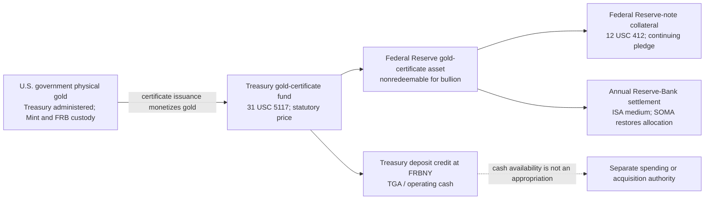
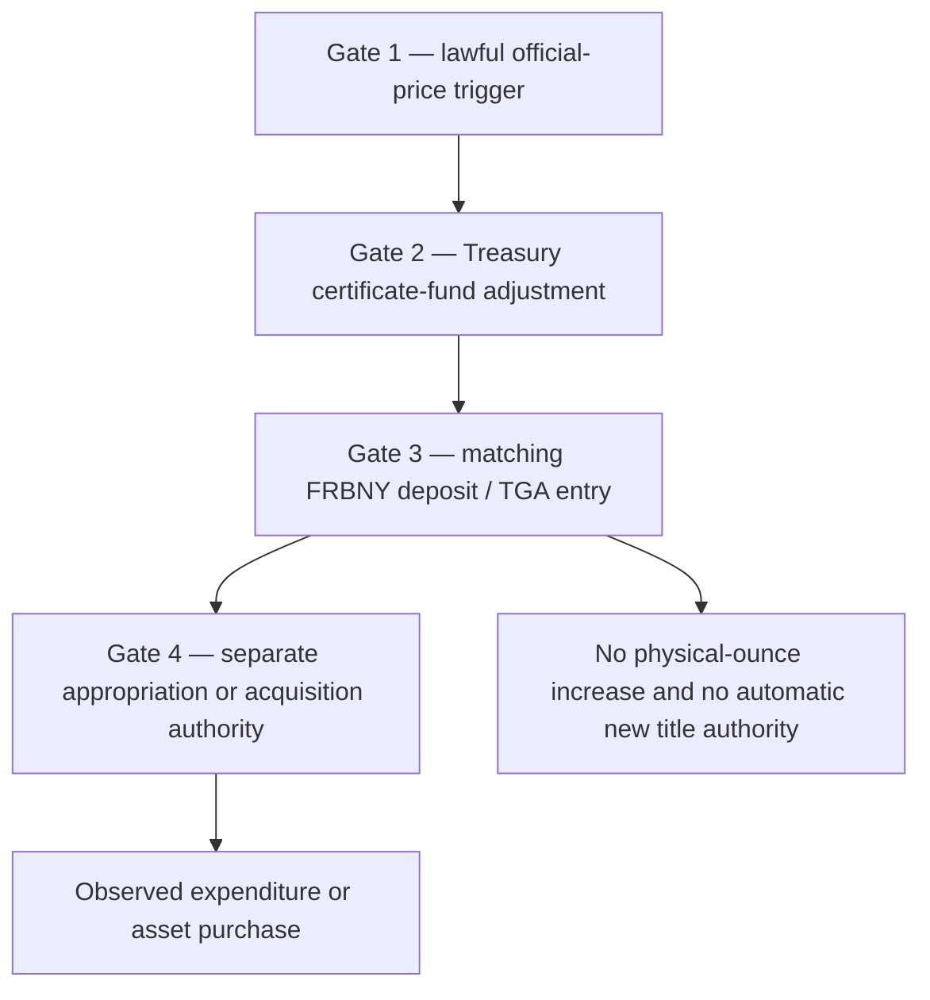

# Gold Monetary-Use Mechanism Map

## Monetary, monetized and mobilized are three different states

Updated: 2026-08-16 ET  
Status: pending workbench research; not reviewed or landed in the vault  
Evidence cutoff: 2026-08-16 ET; each amount and mechanism retains its own clock  
Scope: current official, wholesale, state and private mechanisms that classify, convert, value, settle, pledge, lend or pay with gold  
Boundary: this is a mechanism and evidence-state map, not a gold-price thesis and not a prediction that any dormant authority will be used

Read first:

- [GOLD_USE_HOLDINGS_AND_CUSTODY_MAP_2026-08-16.md](../sources/gold-use-holdings-and-custody-map-2026-08-16-c6534962dbcf.html) — the physical-use, holder, custodian and record topology beneath this monetary layer
- [GOLD_CERTIFICATE_TGA_AUTHORITY_DOSSIER_2026-08-16.md](../sources/gold-certificate-tga-authority-dossier-2026-08-16-6c0f3ff3f84f.html) — who can authorize, execute, record and spend across the U.S. certificate/TGA chain
- GOLD_FIRST_USE_WATCHBOARD_2026-08-16.md — the exact receipts and source clocks for the next evidence-state change
- [WHOLESALE_METALS_MARKET_INFRASTRUCTURE_DEEP_DIVE.md](../sources/wholesale-metals-market-infrastructure-deep-dive-622e4608aaff.html) — New York, London and Asian title-and-settlement plumbing
- WHOLESALE_METALS_DATA_SPINE_SPEC.md — the rule that PRICE, TITLE, FLOW and RULE cannot be inferred from one another
- WHOLESALE_METALS_CLAIM_AUDIT.md — controls against custody, collateral and regulatory overclaims

---

## Short answer

Gold is not waiting for one future event to “become money.” Several narrower mechanisms are already live:

- monetary authorities hold qualifying gold as an official reserve asset;
- the U.S. Treasury has already monetized nearly all U.S. official gold into dollar-denominated gold certificates held by the Federal Reserve;
- those certificates are actively pledged as one small class of collateral against Federal Reserve notes and serve as the annual settlement medium among the twelve Reserve Banks;
- central banks revalue gold at market prices on national or central-bank balance sheets under accounting regimes that do not automatically create spendable cash;
- wholesale systems transfer title, settle bullion-bank debts, accept gold title as collateral and lend or swap gold without requiring the bar to move;
- legal-tender, depository, ETF and token systems can make gold-linked claims transferable, but each has different conversion, redemption, credit and first-use evidence.

The useful distinction is:

| State | Working definition | Proof required |
|---|---|---|
| **Monetary** | A monetary authority or qualifying official holder has title or control and holds the gold as a reserve asset under the applicable statistical/accounting definition | Holder, title/control, reserve purpose and governing accounting perimeter |
| **Monetized** | Gold has been converted into a currency, deposit or certificate claim on an account ledger | Operative authority plus the matching asset, liability and deposit entries |
| **Mobilized** | The metal or its controlling title/claim has actually been used in a payment, settlement, pledge, loan, swap, sale, purchase or other transaction | Dated account-level transaction, collateral, settlement or balance-sheet evidence |

“Eligible,” “classified,” “held,” “market-valued” and “tokenized” do not by themselves prove any of the three.

## The main finding

The most consequential U.S. question is not whether Treasury gold can conceptually be monetized. It already has been, except for a deliberate 100,000-fine-troy-ounce buffer. The open questions are narrower:

1. whether a lawful trigger changes the statutory price or certificate quantity;
2. whether the resulting Treasury deposit entry is made;
3. what separate appropriation or acquisition authority permits that cash to be used;
4. whether gold, a certificate or another gold claim is actually deployed in a transaction.

This breaks the dramatic “gold revaluation” story into independently provable legal, accounting and spending events.

---

## 1. Evidence-state constitution

Every row in this map uses the following ladder. A higher state cannot be inferred from a lower one.

| State | Question | Acceptable evidence | Does not prove |
|---:|---|---|---|
| **0 — proposal or study** | Has someone asked that a mechanism be studied or authorized? | Introduced bill, hearing record, consultation, policy paper | Enactment, authority or operation |
| **1 — legal authority** | Does a current law or binding rule permit the act? | Statute, regulation, effective rule, executed governing agreement | Operational readiness or use |
| **2 — operational eligibility** | Is an object/account/counterparty admitted and capable of use? | Approved collateral schedule, live account terms, implementation notice, custodian/depository approval | An actual pledge, payment or settlement |
| **3 — current stock/accounting state** | Is the asset or claim presently recorded? | Audited statement, current statistical release, reconciled bar/account ledger | A new transaction during the period |
| **4 — observed transaction** | Did the mechanism move title, value or an account balance? | Dated transaction, ledger, settlement, issue/redemption, cash-flow or official deal record | A generalized system-wide effect beyond that transaction |
| **5 — demonstrated effect** | What precisely changed on each balance sheet or payment account? | Matched double entries, before/after statements, final settlement and use-of-funds record | A broader political or price narrative |

Two extra clocks must remain visible:

- **effective law** can precede the first operational date;
- **first eligible transaction** can precede the first observed public transaction.

---

## 2. One physical stock, several non-equivalent books

The same U.S. gold appears differently because each system asks a different question.

| Book / record | Current object | Valuation | Current amount and clock | What changes it | What it does not do |
|---|---|---:|---:|---|---|
| **Treasury/Mint physical stock** | U.S.-government gold by location and operational category | Fine troy ounces plus statutory dollars | **261,498,926.241 FTO / 8,133.526 t** on 2026-07-31; about **$11.041bn** statutory value | Purchase, sale, coin-production use, authorized transfer, inventory correction | Location or custody does not change U.S. title |
| **Treasury fiscal statement** | Gold reserve asset and certificate liability | **$42.2222/FTO** statutory carrying value; market value disclosed separately | FY2025: **$11.041bn** carrying value and **$1.000312tn** market-value disclosure at $3,825.30/FTO | Statutory law/accounting plus physical inventory | The market-value disclosure is not cash, revenue, a certificate issue or debt reduction |
| **Federal Reserve certificate account** | Nonredeemable dollar-denominated certificate asset issued by Treasury | Statutory price | **$11.037bn** on 2026-08-12; approximately $4.222m below gold stock | Issue/redemption, inventory adjustment or official-price adjustment under the governing law | The Federal Reserve does not own or have redemption rights in the backing bullion |
| **Z.1 national financial accounts** | Federal-government monetary gold as a macro-financial asset | Market value | **$1.2272tn** in 2026 Q1 | Market price and qualifying official transactions | Market revaluation here does not adjust the statutory certificate account or TGA |
| **Custody and bar records** | Physical bars/coins held at Mint sites and FRBNY | Quantity, identity, assay and location | Separately reported by facility; much operational detail is not public | Physical movement, transformation, custody instruction and inventory control | A bar ledger alone does not show certificate value, spending authority or an ESF deal |

Sources: [Treasury FiscalData](https://api.fiscaldata.treasury.gov/services/api/fiscal_service/v2/accounting/od/gold_reserve?filter=record_date:eq:2026-07-31&sort=src_line_nbr), [Treasury FY2025 Agency Financial Report, note 6](https://home.treasury.gov/system/files/266/Treasury-FY-2025-AFR.pdf), [Federal Reserve FAQ](https://www.federalreserve.gov/faqs/does-the-federal-reserve-own-or-hold-gold.htm), [H.4.1, August 13, 2026](https://www.federalreserve.gov/releases/h41/current/), and [Z.1 table F1.s](https://www.federalreserve.gov/releases/z1/current/html/F1_s.htm).

### A perimeter note that must not be silently “fixed”

The Z.1 instrument description says all U.S. **monetary gold** is monetized and attributes the asset to the Exchange Stabilization Fund. Treasury and Federal Reserve operational records separately show 100,000 FTO without certificates and Mint/Reserve-Bank custody. The safest reading is a national-accounts sector/perimeter convention, not a bar-level custody statement. This map therefore preserves both official descriptions and does not use Z.1 to erase the operational exception.

---

## 3. The live U.S. certificate machine

The January 2026 Federal Reserve Financial Accounting Manual is unusually explicit:

- Treasury issues certificates to the Reserve Banks “to monetize” Treasury gold and may reacquire them by demonetizing it;
- monetization credits the Treasury certificate fund in exchange for deposit credit at FRBNY, with matching gold-certificate and TGA entries;
- an official-price change causes simultaneous adjustment of the certificate and deposit accounts;
- since 1978 each Reserve Bank's certificate holdings have been pledged automatically under a continuing agreement as security for Federal Reserve notes;
- the certificate account is the medium for the annual settlement of accumulated Interdistrict Settlement Account balances; SOMA securities are then reallocated to restore each Bank's certificate share.

[Federal Reserve Financial Accounting Manual, Gold Certificate Account, pp. 19–20](https://www.federalreserve.gov/aboutthefed/files/bstfinaccountingmanual.pdf)

### What “gold backs Federal Reserve notes” actually means today

On 2026-08-12, H.4.1 reported:

| Federal Reserve-note collateral | $ millions | Share of notes requiring collateral |
|---|---:|---:|
| Gold certificate account | 11,037 | **0.455%** |
| SDR certificate account | 15,200 | 0.627% |
| Treasury, agency debt and MBS pledged | 2,397,683 | 98.918% |
| Total notes to be collateralized | 2,423,920 | 100.000% |

Gold certificates are therefore a live statutory collateral class, not a metaphor. But they are a very small part of the collateral pool, are not redeemable in gold, and do not make an individual note convertible or economically “gold-backed” in the historical sense. [H.4.1 table 7](https://www.federalreserve.gov/releases/h41/current/); [12 USC 412](https://uscode.house.gov/view.xhtml?edition=prelim&num=0&req=granuleid%3AUSC-prelim-title12-section412).

---

## 4. U.S. mechanism matrix

| Mechanism | Authority / operator | Current evidence state | Demonstrated current use | Hard boundary |
|---|---|---|---|---|
| **Government title and custody** | 31 USC 5117(a); United States holds title, Treasury administers, Mint/FRBs hold in custody | **3 — current stock** | 261.499m FTO reported by location on 2026-07-31 | “Treasury owns” is shorthand; the statute places title in the United States. Custody does not establish use |
| **Mint deep storage** | 31 USC 5116 and Mint controls | **2/3 — eligible and held** | 245.263m FTO in Denver, Fort Knox and West Point; Treasury OIG found no deep-storage use in FY2024 or FY2025 | A reserve-use power is not evidence of a draw |
| **Mint working stock and bullion coin sales** | 31 USC 5112/5116; Mint Public Enterprise Fund | **4 — observed sale program** | FY2025 gold-bullion sales: 360,500 oz; $1.0769bn revenue | Bullion coin sales do not prove deep-reserve liquidation or central-bank monetary use |
| **Certificate monetization** | 31 USC 5117(b); Treasury, Board and FRBNY accounting | **3/5 — live stock and demonstrated accounting effect** | $11.037bn certificate asset; all but 100,000 FTO certificated | Certificate is not bullion title and is not publicly redeemable |
| **Federal Reserve-note collateral** | 12 USC 412; Federal Reserve Agents | **4/5 — current pledge and reported effect** | Entire certificate balance automatically pledged; 0.455% of note collateral on 2026-08-12 | One permissible collateral class is not a promise to convert notes into gold |
| **Interdistrict settlement** | Federal Reserve accounting constitution | **4 — recurring accounting operation** | Certificate account is the annual ISA settlement medium; SOMA allocation restores certificate proportions | This is Reserve-Bank internal settlement, not retail or international gold payment |
| **Secretary purchase or sale** | 31 USC 5116(a), with President's approval | **1 — authority** | No current approval/order or transaction receipt located | Sale proceeds are deposited in the general fund solely to reduce national debt; broad power is not a live transaction |
| **ESF dealing in gold** | 31 USC 5302, with President's approval; Treasury Secretary or designee | **1 — authority; historical 4** | Current June 2026 ESF statement has no gold line; documented history includes 1974 and 1978 gold operations | ESF's gold-derived origin and surviving authority do not prove present gold inventory or dealing |
| **American Eagle/Buffalo legal tender** | 31 USC 5112 and 5103 | **2/4 — legal status and market sales** | Coins sold at bullion value plus premium through authorized purchasers | Face-value tender status, bullion-market value and official reserve status are separate |
| **HTS “monetary gold”** | HTS 7108.20.00; CBP/USITC customs administration | **2/4 — live classification at entry** | CBP has classified qualifying coin blanks as monetary gold | Customs classification controls reporting/duty, not sovereign title, reserve designation, purchase or pledge |

Primary support: [31 USC 5116](https://uscode.house.gov/view.xhtml?edition=prelim&num=0&req=granuleid%3AUSC-prelim-title31-section5116), [31 USC 5117](https://uscode.house.gov/view.xhtml?req=%28title%3A31+section%3A5117+edition%3Aprelim%29), [31 USC 5302](https://uscode.house.gov/view.xhtml?req=%28title%3A31+section%3A5302+edition%3Aprelim%29), [Treasury OIG deep-storage audit](https://oig.treasury.gov/system/files/2025-12/OIG-26-002-%28locked%29.pdf), [Mint FY2025 report](https://www.usmint.gov/content/dam/usmint/reports/2025-annual-report.pdf), [June 2026 ESF statement](https://home.treasury.gov/system/files/206/ESF-June-2026-FS-Trunc-Notes.pdf), [ESF history](https://home.treasury.gov/policy-issues/international/exchange-stabilization-fund/exchange-stabilization-fund-history), and [CBP ruling N300205](https://rulings.cbp.gov/ruling/N300205).

---

## 5. The revaluation branch — four gates, not one event

The accounting manual describes what entries follow **when** the official price changes. It does not itself supply the legal trigger for changing the price.

### What a lawful official-price adjustment would establish

- the statutory value of the same physical ounces changes;
- the certificate account and Treasury deposit account adjust together under the Fed's current accounting instructions;
- Treasury gains a deposit balance corresponding to the additional certificate claim.

### What it would not establish by itself

- an appropriation;
- authority to buy Bitcoin, gold or any other asset;
- a change in physical ounces, title, location or assay;
- a sale of gold or reduction in the national debt;
- a market-price peg, note convertibility or gold standard;
- an ESF transaction.

The market-value increase has already occurred on a separate statistical book: Z.1 valued U.S. monetary gold at $1.2272tn in 2026 Q1. That did not alter the $11.037bn certificate account. This is the cleanest proof that **market revaluation is not certificate monetization**.

### Current proposal state

| Proposal | Clock at 2026-08-16 | What it would do | What is not current law |
|---|---|---|---|
| **H.R. 2032 / S. 954** | Introduced and referred in March 2025 | Would require tender and fair-market reissue of certificates, remit an increment, prioritize Bitcoin acquisition and then debt reduction, and amend ESF authority | No tender, reissue, remittance or purchase is operative |
| **H.R. 8957** | Introduced 2026-05-21; referral-only; discussed at a 2026-07-17 field hearing | Would require Treasury/Commerce to **study** budget-neutral Bitcoin routes, including structured acquisition funded through certificate revaluation | A study item is not valuation authority, an appropriation or an acquisition |
| **H.R. 3795 / S. 3218** | Introduced audit/inventory proposals | Would add assay, inventory or audit requirements | The proposals do not prove a shortage, undisclosed lien or failure of existing controls |

[H.R. 8957 introduced text, section 9](https://www.govinfo.gov/content/pkg/BILLS-119hr8957ih/html/BILLS-119hr8957ih.htm) expressly frames certificate revaluation as one mechanism to be evaluated and says the study does not authorize borrowing, new taxation or deficit spending.

---

## 6. Executive-order and entity edges

The reviewed EOs change adjacent control surfaces. None changes U.S. gold title, the $42.2222 statutory price, the certificate balance, reserve classification or ESF transaction state.

| Order | Entity path | Gold edge | Monetary conclusion |
|---|---|---|---|
| **EO 14233 — Strategic Bitcoin Reserve** (2025-03-06) | President → Treasury custody offices; agencies → digital-asset inventory; Treasury/Commerce → budget-neutral strategy evaluation | Uses a reserve architecture and “digital gold” analogy | No physical-gold sale, pledge, revaluation, certificate action or purchase funding identified in the order |
| **EO 14285 — offshore critical minerals** (2025-04-24) | President → Commerce/Interior and permitting/supply agencies | Gold is within an industrial-mineral production perimeter | Production and permitting do not confer reserve or monetary status |
| **EO 14346 — reciprocal-tariff scope** (2025-09-05) | President → Commerce/USTR/DHS → USITC/CBP | Placed gold lines, including HTS 7108.20.00, in an exception list effective 2025-09-08 | Customs treatment did not move title or create a reserve transaction; EO 14389 ended the underlying EO 14257 tariff collections on 2026-02-20, so the exception is now a historical operative state |
| **EO 14303 — “gold-standard science”** (2025-05-23) | President → science-policy entities | Lexical only | Not a gold mechanism |

Sources: [EO 14233](https://www.whitehouse.gov/presidential-actions/2025/03/establishment-of-the-strategic-bitcoin-reserve-and-united-states-digital-asset-stockpile/), [EO 14285](https://www.whitehouse.gov/presidential-actions/2025/04/unleashing-americas-offshore-critical-minerals-and-resources/), [EO 14346](https://www.whitehouse.gov/presidential-actions/2025/09/modifying-the-scope-of-reciprocal-tariffs-and-establishing-procedures-for-implementing-trade-and-security-agreements/), [EO 14389](https://www.whitehouse.gov/presidential-actions/2026/02/ending-certain-tariff-actions/), and [EO 14303](https://www.whitehouse.gov/presidential-actions/2025/05/restoring-gold-standard-science/).

---

## 7. International, wholesale, state and private mechanisms

This section intentionally separates a rule that permits use from evidence that the mechanism is operating. It will be read with the product-specific terms and account records named in the broad custody map.

### 7.1 The international reserve gate

The IMF released BPM7 on 2025-03-20, although broad country implementation is expected mainly in 2029–30. Its definitions sharpen the mechanism map:

- a reserve asset must be external, controlled and readily available to the monetary authority for balance-of-payments financing, intervention, confidence or as a basis for borrowing;
- monetary gold is gold to which the monetary authority, or another unit under its effective control, has title and which is held as a reserve asset;
- allocated accounts preserve ownership of identified or pooled allocated bullion;
- an unallocated gold account is a delivery claim on the account operator, not ownership of a specified bar; it qualifies as monetary gold only when the monetary authority holds it as an available reserve asset;
- gold lent generally remains the lender's asset under economic-ownership accounting;
- gold swapped out and made unavailable must be removed from reserve assets or reclassified, while the cash received and associated liability are recorded separately.

[IMF BPM7 release](https://www.imf.org/en/news/articles/2025/03/20/pr25072-imf-and-statistical-community-release-new-global-standards-for-macroeconomic-stats) and [BPM7 manual](https://www.imf.org/-/media/files/data/statistics/bpm6/draft-bpm7-wcv.pdf), especially paragraphs 5.87–5.88, 6.69–6.87, 7.76 and A7.64–A7.66.

Current reserve templates still often say “gold, including gold deposits and, if appropriate, gold swapped.” That reporting envelope does not prove that a reported holder actually has a deposit or swap, or that swapped gold remains available under the BPM7 test.

### 7.2 Current official mechanisms with observed evidence

| Mechanism and evidence state | Legal object and ledger | Current observed state | Monetary effect | Hard boundary |
|---|---|---|---|---|
| **BoE allocated custody and book transfer — 4** | Customer title to allocated London Good Delivery bars; BoE custody and settlement ledger | Trades commonly settle by changing the recorded owner without moving the bar. Public custody total at 2026-07-31: **181.755m fine oz** | Makes official/customer title transferable at a central-bank custody node | Customer gold is off the BoE balance sheet. Aggregate custody does not prove BoE ownership, reserve purpose, a loan, swap or pledge |
| **BIS central-bank gold deposits and loans — 3/4** | Central-bank gold-denominated deposit claims are BIS liabilities; BIS banking assets include bars, sight accounts and fixed-term gold loans | At 2026-03-31: deposit liabilities **SDR48.2216bn**, banking gold assets **SDR68.2780bn**, gold loans **SDR1.1686bn**; 2026-06-30 unaudited: gold/gold-loan assets **SDR64.9866bn**, deposits **SDR41.6666bn** | Mobilizes central-bank gold claims through a bank balance sheet and a gold-lending book | Does not identify depositors, allocation, loan counterparties or whether each depositor's claim passes the reserve-availability test |
| **BIS swap-associated gold — 3/4** | Gold received under swap contracts is recognized by BIS; derivative positions are recorded separately | **184 t / SDR20.0565bn** held in connection with swaps at 2026-03-31, up from 10 t a year earlier | Proves a live official-institution gold-swap machine and a material associated gold stock | Does not prove a central bank supplied it, disclose the cash leg, maturity, counterparty, location or resolve the outgoing party's reserve treatment |
| **ECB gold ownership and market revaluation — 3/5** | “Gold and gold receivables” asset; unrealized market gains flow to a gold revaluation account rather than income | At 2025-12-31: **16.286m fine oz / 506.5 t**, **€59.754bn**. Quantity was unchanged; the **€18.860bn** increase was price-driven | Active market valuation builds a loss-absorbing revaluation account without a Treasury-style cash credit | Price appreciation is not a purchase, income or freely distributable cash. The aggregate does not reveal bullion versus account/receivable form |
| **Bulgaria-to-ECB reserve contribution — 4/5** | BNB transferred gold and USD to ECB-specified accounts/locations and received an ECB claim under euro-adoption rules | Effective 2026-01-01, settled 2026-01-02: **€222.377m gold** and **€1.260137bn USD** transferred; BNB received a **€485.296m** remunerated, nonredeemable ECB claim plus separate adjustments | A documented conversion of national reserve assets into ECB assets and a central-bank claim | BNB's earlier 66,000 oz purchase does not prove the precise bars/ounces delivered; public sources omit the bar list and location |
| **IMF own gold — 3 with restricted capability** | IMF-owned gold at designated depositories, not member-country reserves | At 2025-04-30: **90.474m fine oz / 2,814 t**; **SDR3.167bn** historical-cost carrying value and **SDR220.3bn** market value | Institutional reserve/value stock under the IMF Articles | IMF may sell or accept gold in repayment under prescribed high-vote authority, but may not buy, lend, lease, swap or pledge it. Market value is not present mobilization |

Primary sources: [BoE gold custody](https://www.bankofengland.co.uk/gold) and [statistics](https://www.bankofengland.co.uk/statistics/gold); [BIS 2025/26 Annual Report](https://www.bis.org/about/areport/areport2026.pdf) and [June 2026 statement](https://www.bis.org/banking/balsheet/statofacc260630.pdf); [ECB 2025 Annual Accounts](https://www.ecb.europa.eu/press/annual-reports-financial-statements/annual/annual-accounts/html/ecb.annualaccounts2025~ba3b593c99.en.html) and [June 2026 reserve template](https://www.ecb.europa.eu/stats/balance_of_payments_and_external/international_reserves/templates/html/ecb.international_reserves_ecb202606.en.html); [BNB purchase notice](https://www.bnb.bg/AboutUs/PressOffice/POPressReleases/POPRDate/PR_20251009_1_EN), [ECB Decision 2026/115](https://eur-lex.europa.eu/eli/dec/2026/115/oj/eng/pdf) and [transfer agreement](https://eur-lex.europa.eu/eli/C/2026/497/oj/eng/pdf); [IMF FY2025 financial statements](https://www.imf.org/external/pubs/ft/ar/2025/pdfs/imf-annual-report-2025-financial-statements.pdf), [gold factsheet](https://www.imf.org/en/about/factsheets/sheets/2022/gold-in-the-imf) and [Articles](https://www.imf.org/external/pubs/ft/aa).

### 7.3 What the international comparison changes

1. **Market revaluation can be active without new money creation.** The ECB's revaluation account absorbs unrealized price gains; it does not resemble a U.S. certificate/TGA entry.
2. **Official gold banking is already active.** BIS deposits, fixed-term loans and swap-associated gold show that central-bank gold claims can be mobilized without a public gold-standard event.
3. **Reserve status can change during a transaction.** A loan may preserve economic ownership; a swap that makes the gold unavailable can require reserve reclassification.
4. **Custody-ledger settlement is real settlement.** BoE title can change by book entry while the bar stays in the vault.
5. **Institutional gold is not interchangeable.** IMF-owned gold is not a member reserve and is more legally constrained than many central-bank holdings.

### 7.4 Wholesale, state and private mechanisms

The controlling distinction here is between (a) actual transfer, settlement, pledge, deposit, financing or redemption and (b) general payment-money use. The first is demonstrably live in several systems. The second is mostly permission or product capability without a verified first transaction.

| Lane and evidence state | Object and controlling record | Observed current use | Hard boundary |
|---|---|---|---|
| **COMEX futures delivery — 4** | Conforming bar plus electronic UCC document-of-title warrant; approved-depository, warrant and clearing-member records | Daily Issues/Stops are actual deliveries: cash is exchanged for electronic title while the bar can remain in the vault | Delivery is not physical load-out and public reports do not identify the ultimate beneficial owner |
| **COMEX warrant collateral — 3/4** | Registered warrant pledged by a clearing member; CME warrant/collateral ledger and Rule 817/UCC lien structure | Gold Stock Reports include a `Pledged_PB` field showing actual aggregate pledged performance-bond stock; qualifying warrants are valued with a 15% haircut | Aggregate use does not reveal pledgor, account, warrant, perfected filing, release or default state |
| **London bullion accepted by CME — 2** | London gold under approved custody/control chain and CME collateral record | House collateral is eligible at a 15% haircut | No public current balance or member-level pledge was located; do not promote eligibility to use |
| **LPMCL/AURUM London settlement — 4** | Usually reciprocal unallocated bullion-bank liabilities; allocation creates a separate identified-bar property state | June 2026 average: **16.7m oz / $70.9bn / 7,227 transfers per day** | Transfers are mostly ledger settlement, not a count of bars moved. LPMCL is not a universal CCP |
| **London allocated/unallocated accounts — 2/4 by customer** | Allocated bar list versus unallocated bank-liability ledger; executed agreement controls liens, set-off, substitution and subcustody | The market and settlement class are live | Public model terms do not prove any particular customer's allocation, lien, balance or transaction |
| **London deposits and gold loans — 4 at market-class level** | Equivalent-metal return claim governed by bullion-account/master-agreement records | LBMA reporting and market rules show active OTC lending/borrowing turnover | Public data do not disclose counterparty, principal, maturity, title chain, repayment or reserve treatment |
| **GLD and IAU basket creation/redemption — 4/5** | Trust owns bullion; investor owns shares; Authorized Participants exchange baskets through trustee/custodian records | GLD quarter ended 2025-12-31: **4.904m oz created / 3.018m oz redeemed**. IAU during 2025: **229.5m shares issued / 55.3m redeemed** | This proves institutional security/gold conversion, not retail bar ownership, withdrawal or payment use |
| **PAXG — 3; transfer live, payment/redemption first use unresolved** | Tokenholder's product-defined beneficial interest in allocated gold; blockchain, Paxos allocation and custody records | Issuance, transfer and monthly reserve attestations are live; qualifying customers can convert/redeem, with roughly 430-token whole-bar gate | Terms say PAXG is not money or legal tender. No public merchant-payment or completed physical-redemption receipt was located; December 2025 terms also lag the June 2026 Solana launch |
| **XAUT — 3; transfer live, payment/redemption first use unresolved** | Issuer-defined undivided interest; blockchain, allocation and unnamed Swiss custodian records | 2026-03-31 assurance: **707,747.090 XAUT** against **707,747.139 fine oz**; transfer system live | Whole-bar/KYC/location gates apply; custodian identity and public completed payment/redemption evidence are missing |
| **Indonesia bullion deposits/financing — 4/5** | Unallocated gram-denominated provider liability; licensed provider's deposit, financing and digital-account records | Pegadaian offers fixed-term deposits paying returns in grams. BSI reported gold financing/pawning and **1,844 kg** digital-gold balances for 2025, then **8.06 t** traded through June 2026 | Strong actual deposit, financing and trading evidence, but not proof of general payment circulation or every provider's reuse/title chain |

Primary sources: [COMEX Chapter 7](https://www.cmegroup.com/content/dam/cmegroup/rulebook/NYMEX/1/7.pdf), [delivery/stock reports](https://www.cmegroup.com/solutions/clearing/operations-and-deliveries/nymex-delivery-notices.html), [CME acceptable collateral](https://www.cmegroup.com/solutions/clearing/financial-and-collateral-management/acceptable-collateral.html), [LBMA clearing data](https://www.lbma.org.uk/prices-and-data/clearing-data), [LBMA clearing architecture](https://www.lbma.org.uk/market-standards/clearing), [LBMA allocated](https://cdn.lbma.org.uk/downloads/LPMCL/1.-Allocated-Account-Agreement-2018-Clean-20231103.pdf) and [unallocated](https://cdn.lbma.org.uk/downloads/LPMCL/2.-Unallocated-Account-Agreement-2018-Clean-20231103.pdf) model agreements, [LBMA metal lending](https://www.lbma.org.uk/publications/the-otc-guide/lending-and-borrowing-metal), [GLD 2025-12-31 10-Q](https://www.sec.gov/Archives/edgar/data/1222333/000143774926002987/gld20251231_10q.htm), [IAU 2025 10-K](https://www.sec.gov/Archives/edgar/data/1278680/000143774926006055/iau20251231_10k.htm), [PAXG terms](https://www.paxos.com/terms-and-conditions/pax-gold-terms-conditions) and [transparency](https://www.paxos.com/paxg-transparency), [XAUT assurance](https://gold.tether.to/docs/reports/attestations/ISAE_3000R_-_Opinion_TGRR_31.03.2026_RC187322026DV0089.pdf), [Indonesia POJK 17/2024](https://www.ojk.go.id/id/regulasi/Documents/Pages/POJK-17-Tahun-2024-Penyelenggaraan-Kegiatan-Usaha-Bulion/POJK%2017%20Tahun%202024%20Penyelenggaraan%20Kegiatan%20Usaha%20Bulion.pdf), [BSI 2025 report](https://www.bankbsi.co.id/storage/reports/8kf42XfUtnWPL3lUQKpvpoXaA4s9Biye1PJ5ZxoG.pdf) and [Pegadaian gold deposits](https://pegadaian.co.id/emas/deposito-emas).

### 7.5 U.S. subnational implementation map

This is not a fifty-state census of every specie statute or tax exemption. It covers the current programs with meaningful depository, debit, electronic-payment or implementation machinery.

| State / lane | Effective mechanism | State at 2026-08-16 | First-use result |
|---|---|---|---|
| **Louisiana legal tender / debit instrument** | Optional gold/silver coin, specie, bullion or gold-backed debit instrument; acceptance is contractual and the instrument may convert gold to fiat | **1/2 — law and provider class** | No named Louisiana provider, funded account, merchant receipt or state payment located. An official fiscal note identified five companies offering means to use gold-linked debit cards, not a transaction |
| **Louisiana Bayou Gold** | Proposed private certified, fully allocated, non-rehypothecated platform with rapid payment and redemption | **0/1 — conditional statute** | HB 797's operative section awaits a later specific appropriation. No registry, certified platform or transaction located |
| **Florida** | Fully allocated custodian interest, electronic-transfer rules and optional government participation through written qualified-public-depository contract | **1/2 — law and rules live from 2026-07-01** | No named licensed gold custodian, government contract, funded account, redemption or first electronic payment located |
| **Missouri** | Electronic representation of actual metal; custody agent converts before remitting public debt | **1/2 — law live** | No custodian/interface or transaction located. The state-facing leg is expressly **U.S. dollars**, not gold |
| **Texas** | Existing Bullion Depository custody is separate from future specie-tender and electronic transactional-currency systems | **3 for custody; 0/1 for payment** | Physical-specie tender takes effect 2026-09-01; electronic system provisions 2027-05-01. At cutoff no transaction can prove those future systems. Lone Star coins/Redback notes are products, not legal tender |
| **Utah** | Treasurer must procure third-party, Utah-held physical-metal system with redemption rights and possible contractor payments | **1 — operative mandate** | No public RFP, award, executed contract, provider, funded account or first payment located |
| **Wyoming mineral trust** | State investment/custody authority for vault-held specie, with possible lease/investment powers | **1/2 — authority and due diligence** | Reports of a completed $10m purchase lack a located Treasurer transaction record, invoice, bar list, custody agreement or audit; hold at likely investment, not proved payment use |

Primary sources: [Louisiana R.S. 6:341](https://www.legis.la.gov/legis/Law.aspx?d=1386342), [HB 797](https://www.legis.la.gov/Legis/ViewDocument.aspx?d=1479085), [Florida §215.986](https://www.leg.state.fl.us/Statutes/index.cfm?App_mode=Display_Statute&URL=0200-0299%2F0215%2FSections%2F0215.986.html), [Florida §560.214](https://www.leg.state.fl.us/Statutes/index.cfm?App_mode=Display_Statute&Search_String=&URL=0500-0599%2F0560%2FSections%2F0560.214.html), [Missouri §408.010](https://revisor.mo.gov/main/OneSection.aspx?bid=57736&section=408.010), [Texas HB 1056](https://capitol.texas.gov/tlodocs/89R/billtext/html/HB01056F.HTM), [Texas Bullion Depository FAQ](https://comptroller.texas.gov/about/media-center/media-kit/bullion/faq.php), [Utah Title 67](https://le.utah.gov/xcode/Title67/Chapter4/C67-4_1800010118000101.pdf), and [Wyoming SF0096 summary](https://www.wyoleg.gov/2025/Summaries/SF0096.pdf).

### 7.6 Actual-use scoreboard

| Proven current state | Mechanisms |
|---|---|
| **Official reserve classification and holding** | U.S. monetary gold; ECB gold; many central-bank holdings under BPM7/BPM6-compatible perimeters |
| **Certificate monetization** | U.S. Treasury gold certificates and matching Federal Reserve/Treasury accounts |
| **Current collateral use** | U.S. gold certificates against Federal Reserve notes; aggregate pledged COMEX warrants |
| **Current settlement/title transfer** | Reserve-Bank annual ISA settlement; BoE allocated book transfers; COMEX warrant delivery; LPMCL bullion-account transfers |
| **Current deposits, loans or swaps** | BIS central-bank deposits/gold loans/swap-associated gold; London OTC metal lending; Indonesian bullion deposits and financing |
| **Current market revaluation** | U.S. Z.1 market-value reporting; ECB/Eurosystem revaluation accounts |
| **Current security/gold conversion** | GLD and IAU Authorized-Participant basket creation/redemption |
| **Transferable token/reserve system** | PAXG and XAUT issuance, custody and token transfers; public first physical-redemption/payment evidence not located |
| **Legal/payment capability without verified first use** | Louisiana, Florida, Missouri and Utah state lanes; Texas tender/electronic lanes are still future-dated |
| **Proposal/study only** | U.S. certificate-revaluation/Bitcoin bills and incomplete subnational implementation branches |

---

## 8. Adjudications for the existing gold plotline

These findings should control any later vault revision. They do not authorize a vault edit in this workbench phase.

| Existing or tempting claim | Adjudication | Replacement wording |
|---|---|---|
| **“Revalue the gold, mark up the certificates, and Treasury gets about $1tn to spend.”** | Over-compressed. A lawful official-price trigger, certificate-fund adjustment, matching TGA entry, spending/acquisition authority and observed use are separate gates. | “Current Fed accounting instructions specify matching certificate and Treasury-deposit entries if the official price lawfully changes; no current trigger or use-of-funds authority has been established.” |
| **“The market revaluation is the monetization event.”** | False join. The United States already reports monetary gold at market value in Z.1 while the certificate account remains at statutory value. | “Market valuation, statutory valuation and certificate monetization are different books.” |
| **“The ESF holds all the U.S. gold.”** | Acceptable only as a Z.1 sector/accounting convention. It is not a physical-custody or current ESF subledger statement. | “Z.1 attributes U.S. monetary gold to the ESF sector; Treasury/Mint/FRB records separately control physical custody and certificate operations.” |
| **“Gold backs the dollar/Federal Reserve notes.”** | Too broad. Gold certificates are current statutory collateral, but only 0.455% of the 2026-08-12 note-collateral pool and are not redeemable for gold. | “Gold certificates are one small, live collateral class for Federal Reserve notes.” |
| **“The current gold tariff exception is active.”** | The 2025 reciprocal-tariff exception was operational, but EO 14389 ended the underlying EO 14257 collections on 2026-02-20. | “The gold-suite exception is a historical operative state; HTS classifications remain live independently.” |
| **“A state has parallel gold money once it passes legal-tender legislation.”** | Not yet proven for the reviewed current programs. Legal status, licensed custody, funded accounts, merchant/public interfaces and first payments are separate clocks. | “Several states have created or scheduled legal and operational lanes; public first-use evidence remains missing.” |
| **“Wholesale gold functions as money.”** | Too loose unless the exact function is named. Current evidence proves title transfer, unallocated bank-credit settlement, collateral, deposits, loans and swaps. | Name the observed function and ledger instead of assigning a universal monetary label. |
| **“A gold-backed token is bar money.”** | Unsupported as a general claim. Token transfer, beneficial interest, allocation, bar title and physical redemption are product-specific states. | “PAXG/XAUT are live transferable gold-linked claim systems with issuer/custodian and conversion gates.” |

The most important vault-level correction is therefore not “the gold story is wrong.” It is that the story currently mixes a real, long-running certificate machine with an untriggered revaluation branch and then skips the separate spending gate.

---

## 9. Research lenses that stay flexible

The next research should follow whichever mechanism produces a new **state change**, not whichever narrative sounds largest.

### Lens A — the three-book seam

Watch for any document that explicitly links:

1. a physical stock or title record;
2. a valuation/certificate account;
3. a cash, settlement or collateral account.

This is where a headline can become a provable monetary mechanism—or fail.

### Lens B — first use after legal eligibility

State tender laws, new depositories, collateral schedules and token terms should be treated as dormant until there is a first payment, pledge, redemption, settlement or official account statement.

### Lens C — official gold lending, swaps and custody

The most informative international comparison is not “who owns the most gold?” It is which authority can allocate, swap, lend, pledge or settle with a claim; which counterparty becomes debtor; whether reserve status survives; and which public record shows an actual transaction.

### Lens D — conversion friction

For each ETF, token, warrant, deposit or legal-tender account, trace:

`cash or security → gold claim → allocated title → physical withdrawal → cash/payment exit`

Identity, size, timing, jurisdiction, lien, market-maker and insolvency gates determine whether a gold-linked claim behaves like money for a particular holder.

### Lens E — the U.S. authorization chain

The decisive future receipt would not be a speech about revaluation. It would be the complete chain:

`law or Presidential approval → Secretary instruction → Treasury/FRBNY entries → authority to use funds → dated transaction → audited balance-sheet effect`.

---

## 10. Non-inference rules

1. **Reserve holding is not a transaction.** A gold stock can remain unchanged while its market value changes.
2. **Market revaluation is not monetization.** Z.1 and Eurosystem revaluation accounts can rise without a Treasury-style deposit credit.
3. **Certificate monetization is not spending authority.** A TGA credit and an appropriation or acquisition mandate are different legal objects.
4. **Collateral eligibility is not a pledge.** A schedule proves capability; only account-level collateral evidence proves use.
5. **A pledge is not a sale.** The owner may retain title subject to a security interest.
6. **Settlement is not necessarily physical movement.** Warrant, allocated-ledger or unallocated-account transfer may leave the bar in place.
7. **Custody is not ownership.** BoE, FRBNY, commercial vault and token-custodian totals can include many owners.
8. **Unallocated gold is a credit claim.** It is not customer title to identified bars.
9. **Legal tender is not circulation.** A statute must be followed by a working account/payment mechanism and an observed use.
10. **Face value is not bullion value.** A legal-tender bullion coin can trade at metal value plus premium.
11. **Customs “monetary gold” is not IMF monetary gold.** Tariff classification and reserve-asset classification use different legal tests.
12. **Token transfer is not bar-title transfer.** The blockchain, issuer allocation ledger and custodian record must reconcile under the product terms.
13. **An ETF share is not a named bar.** Creation/redemption and physical withdrawal are product- and participant-gated.
14. **A bill or hearing is not authority.** Proposal, study, enactment, implementation and first transaction are separate clocks.
15. **A historical operation is not a current one.** ESF's past gold deals demonstrate a mechanism, not present activation.

---

## 11. Current watch receipts

| Trigger | Receipt needed | State change if received |
|---|---|---|
| U.S. official-price action | Enacted law or valid current authority plus Treasury instruction | Proposal/authority → executable trigger |
| New certificate issue/redemption | FRBNY advice, Treasury account detail and H.4.1 change | Stock/accounting → observed monetization or demonetization |
| Use of resulting deposit | Appropriation/acquisition authority plus disbursement record | Cash entry → demonstrated use |
| ESF gold operation | President/Secretary approval, counterparty, gold quantity and ESF statement entry | Dormant authority → observed official deal |
| Deep-storage draw | Secretary approval, Mint inventory change and receiving program record | Eligibility → physical use |
| State gold payment launch | Effective implementation rules, operating account/custodian and first completed payment | Legal tender → observed circulation/payment |
| Exchange/CCP gold collateral | Account-level pledge/encumbrance and valuation/haircut record | Eligibility → actual collateral use |
| Official gold loan or swap | Executed transaction, title/counterparty treatment and reserve/accounting entry | Capability → mobilized reserve asset |
| ETF/token conversion | Completed creation, redemption or physical withdrawal with ledger reconciliation | Transferable exposure → demonstrated conversion |
| Customs movement | Keyed entry data plus title/use evidence | Classification → observed movement, still not reserve use by itself |

---

## Bottom line

The gold plotline is strongest when it stops asking one oversized question—“is gold money?”—and instead asks which legal object is doing which job on which ledger.

The United States already has a functioning gold-monetization machine, but it runs at a frozen statutory price and its certificate claims perform narrow, visible accounting and collateral functions. International authorities actively hold and revalue monetary gold; wholesale and private systems make gold title and gold-denominated credit mobile. The unproven frontier is broader **mobilization**: a new official-price trigger, a new deposit effect, an actual official deal, a first state payment, or a new collateral/settlement use.

That is the research lens to carry forward. It is flexible by design: the next primary-source state change determines the next branch.
