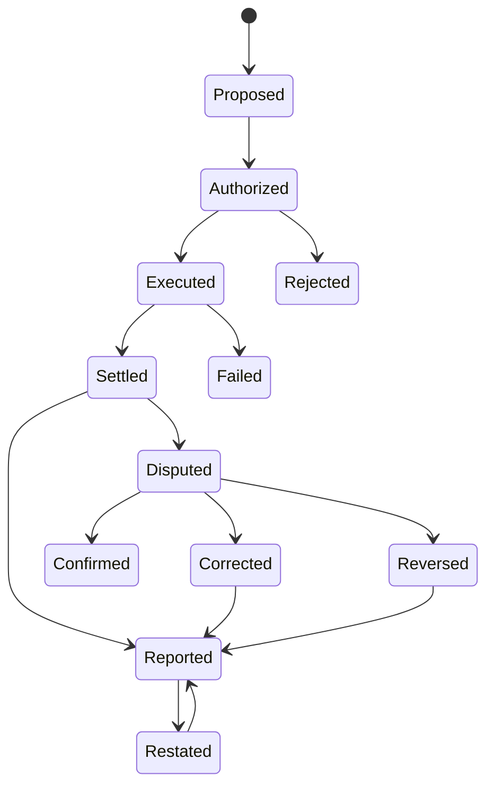

# Transaction-native accounting — open-source, real-time hypothesis map

**Cutoff:** 2026-07-25  
**State:** interpretation-grade hypothesis; integrated into the Observatory
Research Desk; not promoted into a factual vault spine  
**Research Desk role:** interpretation-grade cross-cut; every component claim
must remain tied to its factual package  
**Scope:** business transactions, payments, asset title, accounting,
continuous assurance, financing and public-money transparency  
**Boundary:** this file maps a possible future architecture and the evidence
needed to recognize its arrival. It does not claim that blockchain has
replaced GAAP, that smart-contract bookkeeping is generally live, or that
current tokenization projects have removed banks, clearinghouses, custodians,
auditors or financial statements.  
**Dollar rule:** every monetary amount is written in full nominal dollars.  

---

## 1. Thesis

The deepest monetary transition may not be a new currency. It may be a change
in the **source of accounting truth**:

```text
FROM

business event
    → separately entered into many private ledgers
    → reconciled after the fact
    → sampled by auditors
    → summarized periodically
    → delivered too late for many decisions

TO

authorized executable transaction
    → payment and asset state change
    → one signed canonical event
    → accounting views compiled automatically
    → every objective rule tested continuously
    → authorized users receive current decision information
```

The target is not merely "accounting on a blockchain." It is
**transaction-native accounting**:

> The transaction contains or references the contract, authority, business
> evidence, payment, asset, accounting rule and reporting permissions needed
> to produce its own bookkeeping.

In that model, accounting stops being a delayed reconstruction of business.
It becomes a continuously reproducible view of business while it is happening.

---

## Research Desk reading

### The hypothesis in one sentence

> Accounting may migrate from institution-maintained journals that reconstruct
> transactions after the fact to shared transaction objects that continuously
> generate accounting, assurance and reporting views.

### The strongest present inference

The current evidence does **not** point to one public blockchain replacing
every ledger. It points more strongly to a transitional architecture:

```text
open or standardized transaction schema
  + verified parties and authority
  + several legally controlling institutional ledgers
  + common event identifiers
  + programmable conditions
  + public or permissioned proof surfaces
  + machine-generated accounting views
```

That is still a major change. It can reduce duplicate entry and reconciliation
without immediately removing banks, clearinghouses, ERP systems, auditors or
legal registries.

### The load-bearing question

The decisive object is not the wallet, token or journal entry. It is the
**canonical business event**:

```text
who agreed
  → under what authority
  → to do what
  → what actually happened
  → which money, asset or claim changed
  → when each legal and settlement state became effective
  → how each accounting view was generated
  → how an error, dispute or reversal changed the record
```

If independent systems can reproduce that chain, accounting becomes
transaction-native. If the chain still depends on hidden reconciliations and a
private controlling ledger that cannot be tested, the system remains a faster
version of the present architecture.

---

## Hypothesis ledger

The grades below describe the **state of the hypothesis**, not the desirability
of the outcome.

| ID | Hypothesis | Current grade | What supports it now | What would materially advance it |
|---|---|---|---|---|
| H1 | the source of accounting truth will move from separately prepared ledgers toward signed transaction events | bounded inference | payment rails, depositories, public-payment feeds and accounting systems are becoming more machine-readable and continuous | one production transaction accepted by every party as the common source for payment, title and books |
| H2 | general ledgers will become authorized views compiled from shared events rather than the first place a transaction becomes intelligible | design hypothesis | rules engines and automated journals already exist, but the controlling source records remain fragmented | independent systems reproduce the same complete books from the same event population |
| H3 | audit will move from periodic sample-centered reconstruction toward continuous population testing plus human review of judgment and exceptions | strong functional hypothesis; weak adoption proof | deterministic authorization, duplicate, limit and reconciliation tests can be applied to every event | an independent assurer relies on the event population and compiler rather than a separately prepared management schedule |
| H4 | materiality will move upward from whether an objective transaction is tested to how exceptions, estimates and disclosures affect decisions | logical consequence of H3 | continuous rules can test small and large events alike | standards and assurance reports distinguish full-population control testing from material financial-statement judgment |
| H5 | reconciliation-only intermediaries will shrink, but institutions that supply credit, liquidity, custody, adjudication or loss-bearing will remain | strong inference from the current payment stack | payment and token systems still depend on account access, settlement banks, CCP resources, custodians and courts | production architecture retires a reconciliation function while explicitly preserving and pricing the surviving risk functions |
| H6 | banks will become less important as duplicate-book operators and more visibly important as balance-sheet, liquidity and legal-risk providers | conditional inference | continuous rails do not themselves supply credit or absorb a failed settlement | transaction-native financing advances against verified events while identifying the institution that bears default and liquidity risk |
| H7 | accounting and audit standards must become machine-readable, versioned and executable | necessary condition; not established as a regime | present manuals and standards describe rules for humans and can support internal rules engines | an authoritative standard setter publishes executable logic, test cases and version governance |
| H8 | the first durable deployments will occur in bounded transaction families rather than the entire economy at once | strongest adoption-path hypothesis | depository tokenization, public-payment feeds and shared-ledger pilots begin with controlled participants and defined assets | a bounded production lane completes contract, performance, settlement, accounting and assurance from one event |
| H9 | public money is most likely to use a public-proof/private-record design | strongest governance hypothesis | public access, protected data, authoritative agency records and correction rights cannot be collapsed into one visibility rule | a live system exposes independently verifiable public commitments while authorized reviewers can inspect protected supporting records |
| H10 | open-source code will matter only if governance, schemas, test cases and exit rights are also open and attributable | design requirement | inspectable code alone does not determine access, upgrades, legal finality or data rights | multiple implementations reproduce the ledger and can continue operation after the original operator exits |
| H11 | verified transaction-native collateral can compress lending and approval time | plausible economic hypothesis | current underwriting repeatedly re-verifies invoices, receivables, title and payment state | a lender advances against a current verified event without rebuilding the evidence chain manually |
| H12 | financial statements will survive as standardized snapshots even if bookkeeping becomes continuous | leading counterweight to the replacement thesis | estimates, consolidation, performance interpretation, tax periods and legal reporting still require bounded views | users rely primarily on live reproducible views while dated statements become archival or legal snapshots |

### What would count as a regime event

No single announcement is enough. A regime event requires several gates to
move together:

1. the contract or authority is legally valid;
2. the performance evidence is attributable;
3. money and any asset or title reach specified final states;
4. the same event generates each party's accepted accounting;
5. corrections propagate without erasing history;
6. an independent party can reproduce the rules and balances;
7. courts, regulators, tax authorities or lenders accept the record; and
8. a material duplicate-ledger or reconciliation process is retired.

---

## Causal dependency map

The hypothesis fails if any load-bearing layer remains disconnected:

```text
identity
  → authority
      → enforceable terms
          → performance evidence
              → money / asset / title finality
                  → canonical event
                      → accounting compiler
                          → continuous controls
                              → live reporting
                                  → faster decisions and financing
```

| Dependency | Why it is load-bearing | Failure state |
|---|---|---|
| identity | the system must know the legal person behind an account, wallet or agent | valid signature attached to the wrong or unauthorized person |
| authority | a real person or automated agent needs power to bind the entity | technically valid event that the entity can legally disavow |
| contract | recognition and settlement depend on rights and obligations | payment without a reliable obligation or performance rule |
| performance | most business value occurs outside the ledger | immutable false invoice, nonexistent delivery or corrupted oracle |
| settlement | instruction is not the same as discharged obligation | books update while cash, asset or title remains pending |
| event history | every party must reference the same state transition and correction chain | faster bilateral records that still require multilateral reconciliation |
| policy compiler | different entities need cash, accrual, tax, regulatory and consolidation views | one shared event but incompatible or opaque journals |
| assurance | code, identities, evidence providers and overrides must be tested | automation scales a bad rule or compromised credential |
| governance | someone controls upgrades, pauses, corrections and access | hidden administrator recreates the old middleman with stronger power |

The technical ledger sits in the middle of this chain. It cannot manufacture
the legal and physical truth on either side of it.

---

## Four truths inside one transaction

The phrase “everything is a journal entry” captures an important feature of
modern money, but it needs one accounting correction. A journal entry is not
necessarily the real-world event. It is one entity's classified representation
of that event.

| Truth | Question | Example |
|---|---|---|
| economic truth | what resource, service, risk or control actually changed? | equipment was delivered and control passed |
| legal truth | which obligation, title, entitlement or remedy became enforceable? | buyer obtained title subject to the purchase agreement |
| settlement truth | which account or asset record became final, and under whose rules? | reserve-account cash settled; custodian or registry updated |
| accounting truth | how must each reporting entity recognize, measure and present the event? | buyer records equipment and cash; seller records revenue, cost and cash |

Transaction-native accounting tries to bind these four truths without pretending
they are identical. Its promise is not that the journal entry becomes reality.
Its promise is that every journal can be reproduced from an attributable chain
back to the economic, legal and settlement events.

---

## Competing architectures

These are not merely implementation choices. They lead to different control
systems.

| Branch | Architecture | Current fit | What it preserves | What it risks |
|---|---|---|---|---|
| A | incumbent digitization | strongest near-term fit | banks, depositories, ERP systems and auditors add faster interfaces around their own controlling records | reconciliation improves but hidden authority and duplicate truth remain |
| B | synchronized private ledgers | strong transition fit | each institution keeps its legal ledger while signed events and common IDs synchronize them | one participant can still hold the controlling record or correction power |
| C | public-proof/private-record | strongest public-money fit | protected records remain with authorized institutions; public commitments and revision lineage are independently testable | public proof may be too thin to establish performance or value |
| D | transaction-native regulated network | plausible bounded end state | authorized parties share the canonical event; compilers create entity-specific books | protocol governor, credential issuer or operator becomes a concentrated gate |
| E | public-chain business accounting | weak present evidence | common public ordering, portability and independent verification | privacy, commercial confidentiality, identity, reversibility and legal-title conflicts |
| F | no structural transition | live falsifier | current ERP, bank and audit system absorbs better APIs without retiring duplicate books | speed gains plateau and reconciliation rents remain |

The current record favors **A → B or C → bounded D**, not a direct jump to E.

---

## The institutional reckoning

### Functions likely to contract

- duplicate transaction entry;
- routine bank and counterparty confirmation;
- manual matching of purchase order, invoice, receipt and payment;
- population sampling for deterministic rules;
- manual intercompany elimination where common event IDs exist;
- periodic assembly of ledgers that can be reproduced continuously; and
- data-room production that merely copies already attributable records.

### Functions likely to survive or become more visible

- credit underwriting;
- liquidity provision;
- custody and key recovery;
- valuation of uncertain or illiquid assets;
- legal interpretation;
- tax policy and jurisdiction mapping;
- estimates, impairment and going-concern judgment;
- dispute resolution and due process;
- insurance, guarantees and loss allocation;
- cybersecurity and identity governance;
- oracle and performance-evidence assurance; and
- protocol governance and operator resolution.

### The new assurance object

The assurer would no longer ask only whether management's statements are fairly
presented. The work would split into four objects:

1. **event assurance** — are identity, authority, contract, performance and
   settlement evidence attributable?
2. **compiler assurance** — do the accounting rules generate the required
   entity views?
3. **governance assurance** — who can change code, credentials, permissions,
   corrections and finality?
4. **judgment assurance** — are estimates, valuations, disclosures and
   exceptions reasonable?

This does not eliminate assurance. It removes much of the need to rebuild the
ordinary transaction population from samples and confirmations.

---

## 2. Five objects that must not be collapsed

| Object | Meaning | Does not automatically provide |
|---|---|---|
| open-source code | the public can inspect the program and rule logic | public transaction data, decentralized control or legally valid settlement |
| open protocol/schema | independent systems can construct and interpret the same transaction object | open-source implementation or permission to participate |
| shared ledger | authorized participants reference the same event history | public access, correct accounting or legal title |
| real-time accounting | authorized views update as valid events occur | real-time cash settlement or error-free estimates |
| blockchain | a particular method of ordering, signing and preserving records | valid identity, truthful off-chain evidence, privacy, reversibility or legal finality |

The system can be:

- open-source but privately permissioned;
- publicly viewable but closed-source;
- real-time but centrally administered;
- distributed but legally controlled by one institution;
- cryptographically consistent but economically wrong; or
- technically final but legally reversible.

The desired architecture must state which combination it uses.

---

## 3. Three operating states

### State A — current periodic and institution-centered accounting

```text
contract system
purchase-order system
invoice system
receiving system
bank ledger
custodian ledger
general ledger
tax ledger
regulatory report
auditor workpaper
```

Each record is useful, but the same transaction is repeatedly re-entered,
mapped and reconciled. Control is institution-centered: each party maintains
its own version and later proves enough agreement for a periodic report.

**Primary costs**

- duplicate entry;
- reconciliation;
- confirmation;
- delayed close;
- manual classification;
- sample-based examination;
- stale analysis;
- hidden intercompany flows;
- inconsistent counterparties and identifiers; and
- loss of provenance inside aggregation and consolidation.

### State B — transitional linked-ledger accounting

The transition is likely to combine:

- APIs and standardized messages;
- 24/7 payment rails;
- tokenized representations of existing assets;
- shared transaction identifiers;
- programmable payment conditions;
- continuous-control tests;
- linked contract, invoice and settlement records;
- accounting rules engines; and
- legacy ledgers that remain legally controlling.

This can reduce latency without yet creating one authoritative transaction
record. Much of today's work is in this state: modern interfaces sit above
separate legal ledgers.

### State C — target transaction-native accounting

```text
executable business agreement
        +
verified identity and authority
        +
delivery or performance evidence
        +
atomic money and asset settlement
        +
versioned accounting policies
        =
signed canonical business event
```

Every authorized reporting view is generated from the event and subsequent
state changes. Humans investigate exceptions, estimates and economic meaning
instead of keying and reconciling ordinary entries.

---

## 4. Target architecture

```mermaid
flowchart LR
    A["Business agreement<br/>price, asset, deliverable, dates"] --> B["Identity and authority<br/>legal entity, signer, limits, approvals"]
    B --> C["Performance evidence<br/>delivery, acceptance, usage, oracle"]
    C --> D["Settlement<br/>money, asset, title, collateral"]
    D --> E["Canonical signed event<br/>immutable history plus governed corrections"]
    E --> F["Accounting policy compiler<br/>recognition, classification, measurement"]
    F --> G["Authorized live views<br/>cash, accrual, tax, regulatory, investor"]
    G --> H["Decisions and capital<br/>pricing, hiring, purchasing, lending"]
    H --> A
    E --> I["Continuous assurance<br/>100% rule tests and exception queue"]
    I --> F
```



### Layer 1 — legal entity, identity and authority

Every transaction must name:

- each legal person;
- the wallet or account controlled by that person;
- beneficial owner or related-party status where required;
- authorized signer or automated agent;
- authority source;
- approval limit;
- delegation;
- governing jurisdiction; and
- identity-credential issuer.

A wallet address alone is not an accounting entity.

### Layer 2 — executable commercial terms

The transaction object should contain or securely reference:

- goods, services, asset or financing object;
- quantity;
- price;
- currency or settlement asset;
- payment timetable;
- delivery and acceptance conditions;
- warranties;
- return or cancellation rights;
- collateral;
- interest;
- late and default terms;
- modification procedure;
- dispute process; and
- governing contract version.

The code must distinguish a proposed agreement, executed agreement,
performance, acceptance, settlement, amendment, dispute and termination.

### Layer 3 — performance and off-chain evidence

Smart contracts cannot observe most physical events unaided. Evidence can
include:

- signed delivery receipt;
- sensor record;
- title registry;
- shipping record;
- customer acceptance;
- employee time record;
- inventory scan;
- independent inspection;
- price oracle;
- court order; or
- regulatory approval.

Each evidence provider becomes a control actor. The system must record:

- who supplied the fact;
- what the source could actually know;
- whether the source can amend it;
- the confidence or dispute state; and
- who bears loss if the fact was wrong.

### Layer 4 — money, asset and title settlement

The system must separately identify:

- payment instruction;
- payment authorization;
- funds availability;
- clearing;
- legal finality;
- asset delivery;
- title or entitlement update;
- collateral pledge;
- custody;
- reversal rights; and
- failure or insolvency treatment.

Wallet-to-wallet movement is not enough if the token does not convey the
relevant legal claim or if another ledger controls title.

### Layer 5 — canonical event ledger

The canonical event should preserve:

- globally unique transaction ID;
- legal parties;
- exact timestamps and time zone;
- contract and code version;
- authority;
- linked evidence;
- cash leg;
- asset leg;
- status;
- accounting-policy version;
- corrections;
- superseded events; and
- disclosure permissions.

"Immutable" should mean that history cannot be silently rewritten. It should
not mean that fraud, court orders, mistakes and commercial disputes can never
be corrected.

### Layer 6 — accounting policy compiler

The compiler converts verified events into accounting states.

```text
event
    + legal rights and obligations
    + accounting policy version
    + estimates or oracle inputs
    = journal state and reporting classifications
```

The policy engine must distinguish:

- cash movement;
- asset recognition;
- liability recognition;
- revenue or expense;
- capitalization;
- depreciation or amortization;
- inventory and cost of sales;
- interest;
- taxes;
- foreign-currency measurement;
- fair-value changes;
- impairment;
- contingencies;
- consolidation;
- intercompany elimination; and
- disclosure.

One canonical event can produce different authorized views without creating
different underlying facts:

```text
cash basis
accrual basis
tax basis
regulatory basis
management basis
investor basis
public-money basis
```

### Layer 7 — continuous assurance

Every objectively testable transaction can be checked at execution:

- valid identity;
- valid authority;
- contract active;
- funds available;
- asset exists in the authoritative registry;
- duplicate invoice absent;
- amount within limit;
- required bidding completed;
- related party disclosed;
- accounting rule current;
- payment and delivery agree;
- prohibited counterparty absent;
- sanctions or other legal restriction checked where applicable; and
- required evidence attached.

Continuous assurance does not eliminate all audit. It shifts audit toward:

- source-code and upgrade controls;
- identity governance;
- oracle reliability;
- physical existence;
- valuation and estimation;
- related parties;
- management override;
- exceptions and disputes;
- cybersecurity and keys;
- legal enforceability; and
- whether the system's rules reflect the required accounting framework.

### Layer 8 — reporting, analysis and capital

Authorized users could receive live:

- cash and committed cash;
- revenue, cost and margin;
- receivables and collections;
- payables and payment timing;
- inventory and turnover;
- fixed assets and placed-in-service dates;
- software-development cost;
- debt and covenant capacity;
- collateral availability;
- pension assets and fees;
- project commitments and change orders;
- tax exposure;
- related-party activity; and
- unresolved exceptions.

Financial statements become standardized, timestamped views of the ledger
rather than separately assembled sources of truth.

---

## 5. Example: a `$500,000` equipment purchase

### Current system

```text
purchase approved
    → contract stored
    → purchase order entered
    → vendor ships
    → receiving record entered
    → invoice arrives
    → accounts payable matches documents
    → bank payment approved
    → payment settles
    → accountant capitalizes asset
    → fixed-asset register updated
    → depreciation begins
    → auditor may or may not select it
```

The transaction can appear differently in every system for weeks.

### Transaction-native system

| Event | Smart-contract state | Automatic accounting state | Human exception |
|---|---|---|---|
| agreement signed | authorized commitment for `$500,000` | purchase commitment view updates; no cash or asset yet | unauthorized signer or missing approval |
| equipment shipped | in transit | optional commitment/in-transit disclosure | shipment evidence disputed |
| equipment received | custody obtained | receipt state updates | quantity or condition exception |
| acceptance completed | obligation payable and payment condition satisfied | equipment asset and payable recognized under applicable policy | capitalization policy or control disputed |
| `$500,000` settles | payment final | cash decreases `$500,000`; payable decreases `$500,000` | failed or reversed payment |
| asset placed in service | productive-use state | depreciation begins using approved life and method | useful-life judgment |
| asset modified or sold | amendment/disposal state | cost, accumulated depreciation and gain or loss update | valuation or title dispute |

The transaction is not "booked" later. Its verified state changes compile the
bookkeeping.

### Why fixed assets are the ideal proving ground

The Federal Reserve fixed-asset and renovation inquiry exposes nearly every
problem the hypothesis must solve without requiring a speculative new asset
class.

One project can contain:

```text
legal authority
  → approved capital budget
  → procurement
  → contract
  → change order
  → certified work
  → invoice
  → cash payment
  → construction in progress
  → placed-in-service event
  → depreciation
  → impairment, transfer or disposal
```

The present public record usually exposes only selected pieces on different
clocks. A transaction-native pilot would preserve one project and transaction
key across all of them.

| Evidence object | Event it should prove | Accounting result it should drive |
|---|---|---|
| enabling authority and approved budget | institution may undertake the project and commit funds | commitment and remaining-authority view |
| solicitation, award and contract | named parties, scope, price and terms became binding | executory commitment; no automatic asset yet |
| change order | scope, price or completion terms changed | revised commitment and forecast |
| architect, engineer or owner certification | specified work was completed and accepted | construction-in-progress addition and payable |
| payment instruction and settlement | payable was discharged on the relevant cash ledger | cash and payable reduction |
| placed-in-service record | the asset became available for intended use | classification out of construction in progress; depreciation begins |
| impairment, sale or retirement evidence | future benefit or control changed | impairment, gain or loss, or asset retirement |

This is also a clean audit test. For every dollar added to the fixed-asset
balance, the system should identify:

- the originating transaction events;
- noncash acquisitions;
- transfers between construction in progress and completed assets;
- depreciation and impairment;
- disposals and proceeds;
- internal labor or software allocations;
- who approved each state change; and
- the surviving asset, location, custodian and legal owner.

The resulting rollforward would not be inferred from a year-end balance:

```text
beginning fixed assets
  + verified additions
  + qualifying noncash acquisitions
  + governed transfers
  - depreciation
  - impairment
  - cost and accumulated depreciation of disposals
  = ending fixed assets
```

Each line would be reproducible from the event population. That directly
answers the original renovation question more faithfully than comparing cash
spending with the net balance-sheet change.

---

## 6. Other transaction compilers

| Business object | Trigger | Core automatic accounting | Judgment that remains |
|---|---|---|---|
| product sale | delivery and acceptance | receivable or cash, revenue, inventory reduction, cost of sale | variable consideration, returns, collectibility |
| service contract | verified performance milestone | contract asset/receivable, revenue, cost | measure of progress and acceptance dispute |
| internally developed software | qualifying development work | eligible labor and vendor cost added to software asset | preliminary versus development stage, useful life, impairment |
| pension investment | trade and custody settlement | plan asset, cash, fees and realized activity | valuation, actuarial obligation, beneficial ownership through pooled vehicles |
| repo | execution, novation, collateral and settlement | financing asset/liability, collateral state, interest | legal netting, default exposure and balance-sheet presentation |
| construction | approved change order, certified work and payment | construction in progress, payable, cash | percentage complete, impairment, placed-in-service date |
| grant or public contract | authority, deliverable and payment | obligation, expenditure, asset or expense, recipient | public purpose, performance quality and downstream ownership |

---

## 7. Materiality changes role

Current audit economics use materiality partly to allocate scarce human
attention. A transaction-native system can test every transaction against
objective rules regardless of amount.

The questions separate:

| Question | Future treatment |
|---|---|
| Was the transaction authorized and correctly executed? | test 100 percent of transactions |
| Did the payment and asset states agree? | test 100 percent of linked settlement events |
| Was the accounting rule applied consistently? | compile and test automatically |
| Is an estimate reasonable? | human/model assurance remains |
| Is a smaller fraud or related-party transaction qualitatively important? | continuous exception logic; not excluded merely because it is numerically small |
| Is the combined misstatement material to a standardized report? | materiality still informs reporting opinion and correction priority |

The future principle should be:

> Materiality may affect the interpretation of a financial report. It should
> not decide whether an objectively testable transaction is checked at all.

---

## 8. What happens to the middlemen

| Present function | Automation potential | Function that survives |
|---|---|---|
| data entry | very high | exception correction and master-data governance |
| invoice matching | very high when transaction and delivery objects are linked | disputed quantity, quality and fraud |
| bank payment approval | high for pre-authorized rules | credit allocation, unusual risk and legal holds |
| reconciliation | very high if parties share the authoritative event | cross-ledger and off-chain exception resolution |
| confirmation | high through signed shared events | identity and authority disputes |
| clearing | partial | netting, liquidity, guaranty and default management unless redesigned |
| custody | partial | legal title, safekeeping, key recovery and insolvency protection |
| external bookkeeping | very high for ordinary transactions | policy, exceptions, estimates and advice |
| financial-statement audit sampling | high for deterministic rules | system assurance, estimates, fraud, physical evidence and governance |
| regulatory reporting | high | rule design, supervisory judgment and enforcement |
| lending underwriting | high for verified history and collateral | risk appetite, forward uncertainty and loss-bearing capital |

The architecture does not eliminate every intermediary. It separates:

1. intermediaries paid because records cannot agree; and
2. intermediaries that actually provide credit, liquidity, custody, insurance,
   adjudication or loss-bearing capacity.

The first category can shrink dramatically. The second must be made explicit
and priced honestly.

---

## 9. Business at the speed of money

Real-time accounting can shorten the decision chain:

```text
verified order
    → current inventory and margin
    → current committed cash
    → current collateral and debt capacity
    → automatic policy checks
    → immediate approved action or named exception
```

For financing:

```text
eligible receivable created
    → borrowing base updates
    → programmable advance becomes available
    → customer payment settles
    → advance automatically repays
```

The business no longer waits for a lender to reconstruct its condition from
old bank statements and manually prepared financials.

### The speed stack

Business can move only as fast as the slowest necessary state:

| Clock | Blocking question |
|---|---|
| identity | do we know the party and beneficial controller? |
| authority | may this person or agent bind the entity? |
| commercial | have enforceable terms been agreed? |
| performance | was the good, service or milestone actually delivered? |
| credit | who will advance funds and bear nonpayment risk? |
| liquidity | is the settlement asset available now? |
| settlement | when is the cash, asset or title transfer final? |
| accounting | which recognition and measurement rules now apply? |
| compliance | is a regulatory, tax, sanctions or legal hold unresolved? |
| dispute | can the event be paused, corrected or reversed lawfully? |

Faster payment removes only one clock. Transaction-native accounting matters
because it can expose all of the clocks simultaneously and identify the exact
exception preventing the next state.

### Speed warning

Instant gross settlement can increase immediate liquidity needs by removing
time for netting:

```text
legacy net settlement:
owe $100, receive $90, settle $10

instant gross settlement:
fund $100 before receiving $90
```

The target system therefore needs:

- atomic delivery-versus-payment;
- programmable intraday credit;
- intelligent netting;
- real-time collateral;
- liquidity limits;
- queued execution when safe;
- clear failure states; and
- emergency pause and recovery rules.

Business can move at the speed of money, but operational failure, fraud and
insolvency can move at that speed too.

---

## 10. Public money and information fairness

"Real time" does not require universal exposure of private transactions.
Access should follow legal entitlement and public purpose.

| User | Appropriate view |
|---|---|
| management | full operating and financial detail |
| transaction counterparty | its contract, performance and settlement |
| employee | compensation and benefit rights relevant to that employee |
| lender | agreed cash, collateral, covenant and risk proofs |
| regulator | legally required transaction and risk fields |
| investor | standardized current reporting and governed material events |
| auditor | evidence, code version, controls, exceptions and full authorized trail |
| public | public-money authority, recipient, purpose, deliverable, modifications and payment, subject to lawful privacy and security limits |

Cryptographic proofs can show that a rule was met without publishing every
private field. The fairness objective is:

> A person entitled to reliable information should not wait months merely
> because another institution controls the process of assembling it.

---

## 11. Governance constitution for open accounting

Open-source code is necessary but insufficient. The system needs a public and
versioned constitution covering:

1. **identity:** who can create an entity, wallet or credential;
2. **authority:** who can approve which transaction;
3. **code:** who can propose, review and deploy changes;
4. **accounting policy:** who translates law and standards into executable
   rules;
5. **oracles:** which outside facts are accepted;
6. **privacy:** who can see each field and under what authority;
7. **keys:** recovery, rotation, theft and institutional succession;
8. **corrections:** append-only reversal, restatement and dispute states;
9. **finality:** when payment, title and accounting become legally effective;
10. **insolvency:** which claim survives and which ledger controls;
11. **audit:** reproducibility, control testing and public exception records;
12. **forks:** what happens when code, law or communities diverge; and
13. **exit:** portability and continuity if an operator fails.

An open codebase with closed upgrades and a privileged administrator can
automate centralized control more efficiently than the present system. Every
privileged function must be visible and attributable.

---

## 12. Error, fraud and dispute state machine



No correction should erase the original event. The record should show:

- original state;
- challenged field;
- challenger;
- authority to correct;
- evidence;
- correction or reversal;
- affected accounting periods and reports; and
- who absorbed any loss.

---

## 13. Current signals versus the proposed regime

| Observed signal at the cutoff | What it proves | What it does not prove |
|---|---|---|
| instant central-bank payment services operate continuously within their rules | final central-bank-money settlement can operate outside traditional business hours | universal wallet settlement or business-contract accounting |
| DTC processed limited production transactions using tokenized representations of DTC-held securities on 2026-07-15 | a regulated depository can connect controlled entitlements to blockchain-based workflows | open accounting, replacement of DTC, independent on-chain title or general service launch |
| DTC describes an October 2026 service-launch target | a production expansion is scheduled | the target has occurred |
| Federal Reserve and central-bank researchers have built or studied programmable monetary-policy and tokenized-finance tools | smart-contract workflows are technically and institutionally under study | live autonomous monetary policy or public real-time accounting |
| clearinghouses extend hours and modernize matching, margin and settlement | the authoritative middle is becoming more continuous | clearinghouses or settlement banks have been eliminated |
| accounting manuals contain software-capitalization and ownership rules | present institutions can account for new systems | those rules are machine-readable or applied transparently transaction by transaction |

The present record is a **transition signal**, not the target architecture.
Tokenization currently appears at least as capable of strengthening incumbent
depositories and clearing utilities as of dismantling them.

---

## 14. Transition roadmap and gates

### Phase 0 — common identifiers and schemas

**Build**

- legal-entity and wallet identity;
- transaction IDs;
- contract, asset, invoice and settlement schemas;
- rule-version metadata; and
- authority credentials.

**Gate:** two independent systems reproduce the same transaction object.

### Phase 1 — signed event ledger beside existing books

**Build**

- signed contract and performance events;
- immutable history with governed corrections;
- links to bank settlement and asset registries; and
- read-only accounting views.

**Gate:** shared events reconcile to existing legal books across a complete
reporting period.

### Phase 2 — accounting compiler in shadow mode

**Build**

- machine-readable recognition and classification policies;
- automated journals;
- consolidation and intercompany provenance;
- tax and regulatory views; and
- exception queue.

**Gate:** compiled accounts reproduce approved financial statements and expose
all differences.

### Phase 3 — continuous assurance

**Build**

- 100 percent deterministic rule tests;
- code and oracle control reports;
- real-time related-party and authorization checks;
- immutable exception disposition; and
- auditor/regulator interfaces.

**Gate:** an independent assurer can reproduce the ledger, tests and exception
population without relying on management's separately prepared schedule.

### Phase 4 — programmable settlement and financing

**Build**

- atomic cash and asset settlement;
- real-time collateral;
- programmable credit;
- netting and liquidity controls;
- bankruptcy treatment; and
- interoperable wallets.

**Gate:** a legally enforceable transaction settles, books and finances from
one event without manual reconciliation.

### Phase 5 — statutory and standards recognition

**Build**

- legal recognition of authoritative records;
- machine-readable accounting and audit standards;
- privacy and public-access law;
- correction, dispute and court procedures; and
- operator resolution and portability.

**Gate:** courts, regulators, tax authorities, lenders and auditors accept the
same canonical event without requiring a separate controlling paper or legacy
ledger.

### Phase 6 — retire duplicate ledgers and periodic assembly

**Build**

- migration and archival proof;
- public reproducibility;
- continuous reporting;
- standardized snapshot views; and
- operator-exit plans.

**Gate:** ordinary business no longer requires duplicated entry,
reconciliation and manual financial-statement assembly.

---

## 15. Evidence that would show the regime is becoming real

Strong evidence would include:

1. an open transaction schema linking contract, authority, performance,
   settlement and accounting;
2. a production business transaction that automatically generates accepted
   cash, accrual, tax and regulatory records;
3. independent reproduction of balances from public or permissioned event
   data;
4. a legal ruling or statute recognizing the canonical event as controlling
   title and obligation;
5. continuous assurance over the full transaction population;
6. a lender advancing immediately against verified transaction-native
   collateral;
7. a public agency publishing contract, modification, delivery, payment and
   asset provenance in one trace;
8. financial restatements represented as governed event corrections rather
   than overwritten reports;
9. an operator failure in which another implementation reconstructs and
   continues the ledger; and
10. retirement of a material legacy reconciliation process.

---

## 16. Falsifiers and failure modes

The thesis weakens if:

- "open source" refers only to a client interface while the controlling ledger
  and upgrades remain closed;
- tokens remain representations whose legally controlling records sit
  elsewhere and cannot be independently reconciled;
- accounting views cannot handle amendments, estimates, consolidation,
  impairment or insolvency;
- smart contracts require more manual exception processing than they remove;
- faster settlement creates liquidity costs greater than the reconciliation
  savings;
- privacy rules make ordinary business unusable or public money untraceable;
- oracle and identity failures repeatedly corrupt the canonical record;
- courts require separate legacy records for enforcement;
- institutions recreate the current middlemen as private protocol governors;
  or
- no business retires its duplicate ledger, periodic close or manual audit
  process.

---

## 17. Research routing across the Observatory

| Existing track | Question introduced by this map |
|---|---|
| Federal Reserve entity and software map | which Reserve Bank controls the source code, accounting compiler and authoritative System record? |
| Fed uses-of-money ledger | can every external payment retain recipient, purpose, contract and asset provenance after consolidation? |
| pensions | can the System expose current beneficial holdings, fees, managers and valuation without waiting for annual aggregation? |
| fixed assets and renovations | can contract, change order, certified work, payment, construction-in-progress and placed-in-service events remain linked? |
| payment-stack audit | which event is legal finality, which ledger wins, and where does a correction propagate? |
| centrally cleared repo | can programmable bilateral or multilateral settlement preserve netting without adding another private control layer? |
| DTC tokenization | does the token become the authoritative title record or remain a controlled representation of the depository entitlement? |
| government-wide audit | can every public-dollar transaction be tested while preventing estimates of waste, fraud and improper payments from being collapsed? |
| congressional monetary infrastructure | when do blockchain books and records become legally recognized rather than merely permitted for a pilot? |
| judicial money | which court recognizes which record in ownership, insolvency, attachment, forfeiture and remedy? |
| emergency monetary policy | how does the ledger pause, recover, reconstruct and allocate loss during a cyber or liquidity event? |

---

## 18. Bottom line

The proposed end state is:

```text
open code
+ open standards
+ verified legal identity
+ executable business terms
+ linked performance evidence
+ atomic money and asset state
+ canonical signed event history
+ machine-readable accounting policies
+ continuous rule testing
+ permissioned live reporting
+ governed corrections and legal finality
```

Its promise is not merely faster bookkeeping. It is:

- fewer duplicate ledgers;
- fewer institutions paid only to reconcile records;
- every objective transaction rule tested;
- provenance preserved through consolidation;
- faster business and financing decisions;
- clearer public-money accountability; and
- financial statements that can be reproduced rather than trusted as a
  delayed institutional assertion.

The central control question remains:

> Who may define, change, observe, correct and legally enforce the canonical
> event?

If that answer is open, attributable and contestable, real-time accounting can
reduce institutional opacity. If it is not, the same technology can automate
the present concentration of power.

---

## Current primary anchors

- [Federal Reserve FedNow questions and answers — continuous processing and master-account settlement](https://www.federalreserve.gov/paymentsystems/fednow-additional-questions-and-answers.htm)
- [DTCC limited-production tokenized transactions, 2026-07-15](https://www.dtcc.com/news/2026/july/15/dtcc-turns-tokenization-into-reality)
- [SEC no-action letter for the DTC tokenization service, 2025-12-11](https://www.sec.gov/files/tm/no-action/dtc-nal-121125.pdf)
- [Federal Reserve Financial Accounting Manual — internal-use software](https://www.federalreserve.gov/federal-reserve-banks/fam/appendix-d-software.htm)
- [New York Fed — Composable Finance, January 2026](https://www.newyorkfed.org/medialibrary/media/research/staff_reports/sr1177.pdf)

## Controlling workbench context

- `Research Packages/Monetary Cross-Cuts/THE_OVERALL_MONETARY_PLAY.md`
- `Research Packages/Fed, Clearing and Treasury/FED_PAYMENT_STACK_CONTROL_FINALITY_AND_COST_AUDIT_2026-07-25.md`
- `Research Packages/Fed, Clearing and Treasury/FED_CENTRALLY_CLEARED_REPO_ACCOUNTING_AND_CONTROL_CASE_STUDY_2026-07-25.md`
- `Research Packages/Fed, Clearing and Treasury/FEDERAL_RESERVE_SYSTEM_ENTITY_TRANSACTION_AND_SOFTWARE_MAP.md`
- `Research Packages/Fed, Clearing and Treasury/FEDERAL_RESERVE_USES_OF_MONEY_LEDGER_2025.md`
- `Research Packages/Congressional Monetary Infrastructure/DTC_TOKENIZATION_SOFT_LAUNCH_STATUS_2026-07-15.md`
